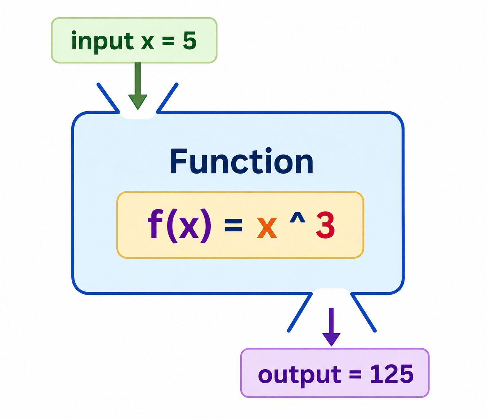
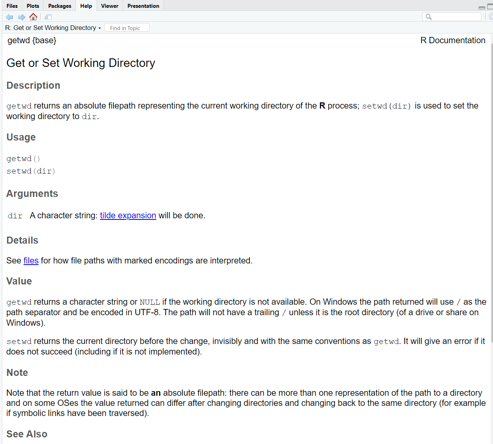
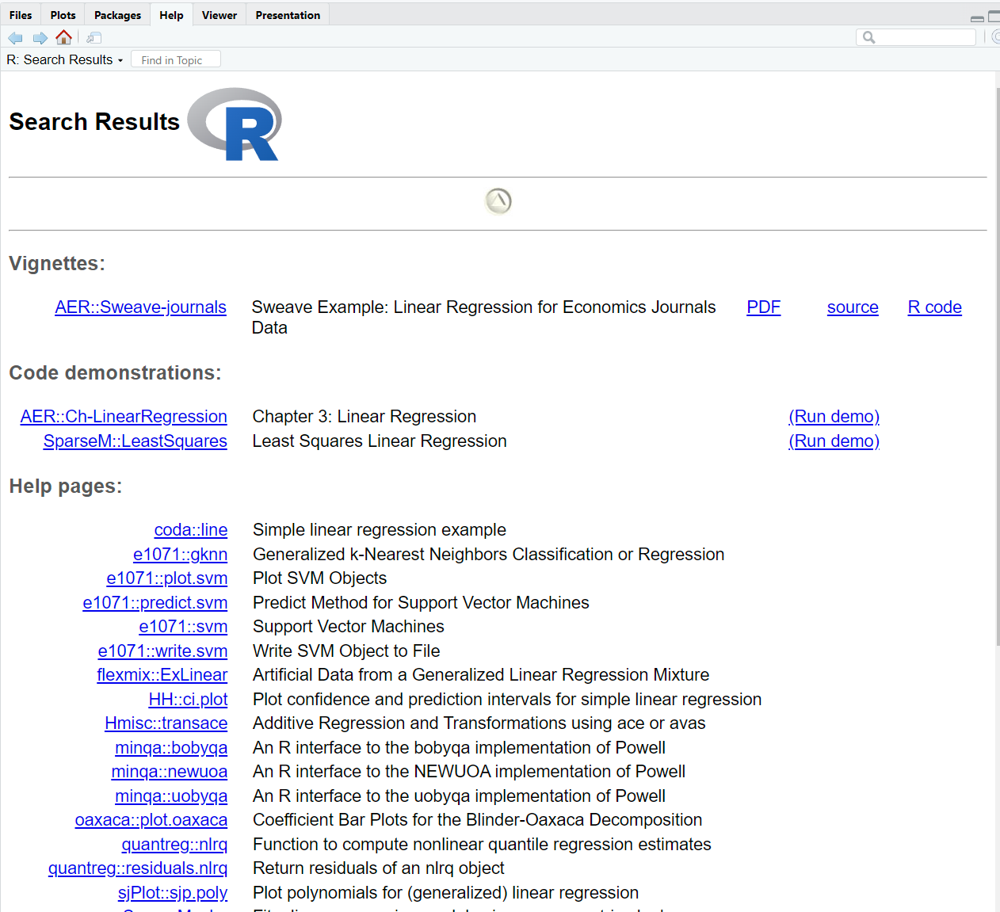
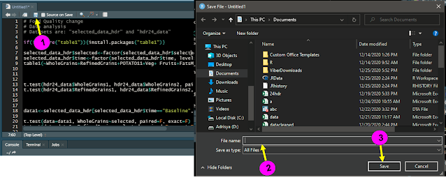
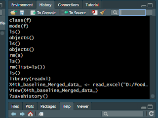

---
output:
  pdf_document:
    number_sections: yes
  html_document: default
---

# Basics in R: Part-1

```{r, include=FALSE}
# install.packages("KoboconnectR")
library(KoboconnectR)

# install.packages ("gsheet")
library(gsheet)

username="nepalcovidtracking"
pwd="159357covid"

```

## Introduction to Function

Before getting into R, lets learn about function. In simple terms, a function is something that takes inputs, processes them, and generates outputs. A function is a sequence of program instructions that perform a specific task. We can create a function and call it multiple times as per our needs. Thus, we don't need to write the same piece of code again and again.



In the figure above, function $f(x)$ processess the input of 5 and gives output of 125. This showed that, function needs input which when processed gives an output.

The different parts of a function are:

-   **Function Name** − This is the actual name of the function. It is stored in R environment as an object with this name.

-   **Arguments** − An argument is a placeholder. When a function is invoked, you pass a value to the argument. Arguments are optional; that is, a function may contain no arguments. Also arguments can have default values.

-   **Function Body** − The function body contains a collection of statements that defines what the function does.

-   **Return Value** − The return value of a function is the last expression in the function body to be evaluated.

In R, the functions are called by their name and inputs are kept inside small bracket separated by comma.

::: callout-important
**Define function**

We can define functions in R using the **function** keyword followed by the function name and block of code inside the curly braces **{ }**.

```         
function_name <- function ( arg1, arg2, .... ) {
    # Function body starts
    # rest of the function code
    # return value
}
```

**Calling function**

In order to execute the created function, we need to call a function which we can do by writing the name of the function followed by arguments of the function (if required) inside the parentheses, separated by "comma".

```         
function_name( arg1, arg2, .... )
```

**Calling Function without arguments**

```{r}
# Initialising a count variable
count <- 0

# Function definition
Num_caller <- function(){

    #Incrementing the count
    count <<- count + 1
  
    #Checking required conditions
    if(count == 1){
        print("First call to the function")
    }else if(count == 2){
        print("Second call to the function")
    }else{
        print("function called more than twice")
    }
}

#Calling the function without arguments
Num_caller()
Num_caller()
Num_caller()
```

**Calling Function with arguments**

```{r}
# Function definition
evaluate <- function(a, x, b){
    return  ((a*x) + b)
}

#Calling the function correct an order
result1 <- evaluate(2, 3, 4)

#Calling the function in random order
result2 <- evaluate(b = 4, x = 3, a = 2)

#Printing both the results
print(paste("First result: ", result1, "\n"))
print(paste("Second result: ", result2))
```

**Calling function with default arguments**

```{r}
# Function definition
evaluate <- function(a=2, x=3, b=4){
    return  ((a*x) + b)
}

#Calling with no argument
print(evaluate())

#Calling with a single argument
print(evaluate(2))

#Calling with two arguments
print(evaluate(5, 4))

#Calling with three arguments
print(evaluate(2, 3, 4))
```

**Lazy evaluation of function**

In R, arguments are evaluated lazily. Here, lazily means that the arguments will get used in the function whenever needed. If any argument is passed but not needed in the function body, then it will get neglected by the function. Thus, we can optimise resource utilisation and increase the function performance with this feature.

```{r}
# Function definition
my_function <- function(a, b, c) {
    result <- 2 * a + b;
    print(paste("Result is:",result))
}

# Calling the function with lazy evaluation
my_function(2, 3, 4)
```
:::

## Types of functions:

There are two types of functions

1.  Built in function

2.  User defined function

### **Built in Functions:**

R contains a wide variety of built-in functions in the base R package. Build-in functions are pre-defined functions available to the user in R. These functions enable the user to perform some common operations without any need to implement them. Some build-in functions available in R are `sum()`, `sqrt()`, `mean()`, `max()`, `min()`, `log()`, etc. Some other examples of inbuilt functions are

-   To get path of working directory: `getwd( )`

-   To setup path of working directory: `setwd("C:/Folder1/Folder1_1")`

-   To seek help: `help( )`

-   To calculate mean: `mean(x, na.rm=T )`

In the following code, we used some built-in functions. `print()` function takes input of all values to print and provides output of whats input is present. `paste()` function takes inputs and paste the values entered inside it as input. `sum()` function takes numerical input and calculate sum, `sqrt()` function takes value and calcualte square root. `abs()` function takes numeric value and calcualte positive value. Similarly `max()` and `min()` calcualte maximum and minimum values within the list of numbers.

```{r}
# Sum of three numbers
print(paste("The Sum of numbers is : ",sum(7, 41, 52)))

# Square root of a number
print(paste("Squre root is: ",sqrt(64)))

# Absolute value of a number
print(paste("Absolute value is: ",abs(-56.5)))

# Maximum of given numbers
print(paste("Maximum value is: ",max(655, 52, 33, 44)))

# Minimum of given numbers
print(paste("Minimum value is: ",min(23, -27, 0, -8)))
```

### **User-defined function**

As the name suggests, these functions are created by the users. R allows us to create our own functions for some specific tasks. It allows us to make our code more readable and add modularity to our program. 

```{r}
# User-defined sum function
sum_numbers <- function(val1, val2, val3){
    return (val1 + val2 + val3)
}

#User-defined absolute function
abs_value <- function(val){
    if(val<0){
        return (val * -1)
    }else{
        return (val)
    }
}


# Print results
paste('Sum of numbers is: ', sum_numbers(1, 2, 7),"\n")
paste('Absolute value is: ', abs_value(-55))
```

## Setup working directory

Lets start using R by setting up working directory. In order to setup working directory, first you need to know which is your working directory and if it is not in right place you have to setup working directory. The function that help you to know your working directory is `getwd( )` and the function that help you to set your working directory is `setwd( )`.

```{r, warning=FALSE}
# identify working directory
 getwd( )

# setup working directory
 setwd("D:/Epi Biostat with R/Biostat_with_R/Environment/") # put the path to folder as input
```

## R as a calculator

R can serve as a powerful calculator capable of performing basic arithmetic operations (addition, subtraction, multiplication and division), and handling various mathematical functions (square roots, logarithms, trigonometric functions, and so on). R provide user-friendly and efficient environment to perform simple calculations to complex mathematical operations.

```{r}
# Addition
2 + 9

# Substraction
6 - 18


# Multiplication
4.54 * 6

# Remainder
5 %% 2

# Division
16/4

# Power
7^5

# Simplication
(3 + 4)*6

# Natural log of 10
log(10)

# log with base of 10
log(100, base = 10)

# Square root
sqrt(16)

# Exponential
exp(10)

# Generate sequence of number
seq(1, 20, 1)
```

Here, we can nest mathematical function inside the other mathematical function.

```{r}
# log of square root of 23
log(sqrt(49))

# Square root of absolute value -25

sqrt(abs(-36))
```

## Operators in R

### Assignment operator

Assignments in R involve storing values or results of expressions in variables. The assignment operator in R is **`<-`** (less-than sign followed by a hyphen), though **`=`** can also be used as a valid alternative.

::: callout-tip
You can use the keyboard shortcut `Alt + =` to instantly insert the assignment operator.
:::

```{r}
# Assignment examples
# The value 5 is stored in the variable 'x' 
x <- 5           
# The value 3 is stored in the variable 'radius' 
radius <- 3      
# The result of the expression is stored in 'area' 
area <- pi * radius^2  
```

It's essential to note that assignments are evaluated right-to-left. The expression on the right is calculated first, and then the resulting value is assigned to the variable on the left.

You can also use the **`assign()`** function for dynamic assignment, where the variable name is passed as a character string.

```{r}
# The value 10 is assigned to the variable 'z' 
assign("z", 10)   
```

Assignments allow you to store intermediate results, perform calculations, and build complex analyses in R. They make your code more efficient and readable, as you can refer to variables with meaningful names rather than using direct values throughout your scripts.

### Other operators

Besides the common arithmetic operators, R supports a variety of other operators:

1.  **Relational Operators:**

    -   **`<`** (less than)
    -   **`>`** (greater than)
    -   **`<=`** (less than or equal to)
    -   **`>=`** (greater than or equal to)
    -   **`==`** (equal to)
    -   **`!=`** or **`<>`** (not equal to)

2.  **Logical Operators:**

    -   **`&`** (element-wise AND)
    -   **`|`** (element-wise OR)
    -   **`!`** (logical NOT)
    -   **`&&`** (AND, stops if the first condition is FALSE)
    -   **`||`** (OR, stops if the first condition is TRUE)

3.  **Miscellaneous Operators:**

    -   **`%*%`** (matrix multiplication)

    -   **`%in%`** (returns a logical vector indicating if there is a match)

    -   **`:`** (creates a sequence of numbers)

    -   **`%>%`** or `|>` (pipe operator used in the **`magrittr`** and **`dplyr`** packages for chaining operations)

## Adding comments

Include comments in your code to explain complex logic, document assumptions, and provide context. Well-placed comments increase code readability and help others understand your thought process.

::: callout-tip
Use the keyboard shortcut `Ctrl + Shift + C` to instantly comment out the lines of codes or annotations.
:::

## Seeking help

In R, searching R help pages is an essential skill for getting assistance and understanding the usage of functions, packages, and various topics related to R programming. You can search for R help pages in several ways:

1.  **Using the `help()` function:** The primary method to access help in R is using the **`help()`** function or its shorthand **`?`**. You simply pass the function's name or topic as an argument to **`help()`** or **`?`**, respectively.

    ```{r, eval=FALSE}
    # Using help() function 
    help(getwd)  
    # Using ? operator 
    ?setwd 
    ```

    {width="798"}

2.  **Search for Keywords:** You can also use the **`help.search()`** function to search for keywords across all available help pages. This function will list all the topics that match the provided keywords.

    ```{r, eval=FALSE}
    # Search for keywords 
    help.search("linear regression") 
    ```

    {width="815"}

3.  **Use Books**

4.  **Use [cheat sheets](https://www.rstudio.com/resources/cheatsheets/) of different packages**

5.  [**Google**](https://www.google.com/) **Search**

6.  **Ask questions in [Stackoverflow](https://stackoverflow.com/)**

7.  **Consultation with experts**

## Create Project

A project in RStudio is a working directory designated with a specific R context, including user-defined settings and files. Using projects in RStudio offers several benefits:

-   **Isolation**: Each project operates independently, with its own R scripts, data files, and settings. This isolation helps prevent conflicts between different projects.

-   **Reproducibility**: Projects make it easier to replicate results as all relevant materials are contained within one directory.

-   **Portability**: Transporting or sharing a project is as simple as zipping the project directory and sending it to collaborators.

Here’s how to create your first project:

1.  Open RStudio to get started. The interface consists of several panes for scripts, console output, environment variables, and more.

2.  Click on **`File`** in the top menu.

3.  Select **`New Project`** to initiate a new workspace.

4.  **Choose the Project Type:** You will see options for where to place your project:

    1.  **New Directory**: Create a project in a new folder.
    2.  **Existing Directory**: Set up a project in an already existing folder.

    For a new project, select **`New Directory`**, then choose:

5.  **New Project**: Creates a basic project structure.

6.  **Configure the Project**

    -   Specify the project name and the directory where it should be stored. This directory will contain all the project’s files.

7.  Click **`Create Project`** to finalize the setup.

## Create folders and files (.R, .txt, .rmd etc.)

RStudio allows you to create folders and files manually and using code. The steps and code are given below:

### Create Folder

1.  In order to create folder, right-click the project root folder in the files pane.

2.  Select New Folder, type the folder name, and press Enter.

If you want to create folder using code:

```{r, eval=FALSE}
# Create a folder named Datasets

folder <- "Datasets2"

# Create directories if they do not exist

path <- file.path(getwd(), folder)

if (!dir.exists(path)) {
    dir.create(path)
  }

```

### Create files

1.  In order to create Files, navigate to the directory where you want the new file in the files pane.

2.  Click the New File button, choose the file type (e.g., R Script, R Markdown, text, etc), and name your file. In R script or R markdown, you can write your code.

3.  Save the file within the intended folder.

if you want to create file using code:

```{r, eval=FALSE}

# Create an  R script
r_script_file <- file.path(getwd(), "script.R") # Script.R is the name  of the r script file

file.create(r_script_file)

# You can write in the created r script file from the code
writeLines(c("# Initial setup", "library(dplyr)"), r_script_file)

```

## Packages in R

As of Feburary 2024, there were over 20431 packages available on the **C**omprehensive **R** **A**rchive **N**etwork, or CRAN. The list of packages that are available in the CRAN can be visualized in the [**link**](https://cran.r-project.org/web/packages/available_packages_by_date.html) . In order to use the functionalists of the package, it is essential to install the package and load the package before using them. Installation of package can be done using `install.packages( )` function and you can load package using `library( )`.

```{r, eval=FALSE,echo=FALSE,results='hide'}

# install package: install.packages("<Package's name>")
# Example : install tidyverse package
  install.packages("tidyverse")

# load library: library("<Package's name>") 
# Example: load tidyverse package
  library(tidyverse)

```

## Importing data into R

Data are present in CSV files (.csv), Excel spreadsheets (.xlsx), SPSS (.sav), SAS files(.sas), Stata files (.dta) or can be in Google sheets or in the servers like Kobotoolbox. You can import data visually or using code. If you are trying to import data visually. First of all go to top right panel where you can see "import dataset". Click the "import dataset" button. and select format of dataset (SPSS, STATA, Excel ,CSV, Text, SAS). Add path to dataset and rename dataset.


The sample datasets that are used in this chapter can be downloaded from the google drive link below. Please keep them in your project folder inside a folder named **"Datasets".**

Sample excel (.csv) file: [dt.csv](https://drive.google.com/file/d/1RovcGcliSq-u2MuXmfirhNWPhDwa-ST-/view?usp=sharing)

Sample excel (.xlsx) file: [dt.xlsx](https://docs.google.com/spreadsheets/d/14pqIkM-OaOfpisYo4gPhJ17xFEvpl9Wd/edit?usp=sharing&ouid=108599188159749824841&rtpof=true&sd=true)

Sample spss (.sav) file: [dt.sav](https://drive.google.com/file/d/1FA94PgbwE_hQYgEQVkghrY8_on174QZw/view?usp=sharing)

Sample stata (.dta) file: [dt.dta](https://drive.google.com/file/d/14IloLS5WhcztQ3jNAVV3B_ySE2QPQCn0/view?usp=sharing)

<br>

The code to import different data formats into R are explained below:

### **Comma separated values (.csv) files**

R can read CSV files natively using `read.csv()` as csv files are simpler and contain only the raw data. The other alternative functions to import csv files in R are `read_csv` from `readr` package and `fread()` for large datasets from `data.table` package.

```{r, eval=FALSE}
# Load data from a CSV file
data <- read.csv("Datasets/dt.csv")

# View the first few rows of the data
head(data)
```

### **Excel (.xlsx) files**

R required installation of packages like like **`readxl`**, **`openxlsx`**, or **`writexl`** to import excel files into R. Here's an example using `readxl`.

```{r, eval=FALSE}
# Install and load the 'readxl' package if not already installed
install.packages("readxl")
library(readxl)

# Load data from an Excel (XLSX) file
data <- readxl::read_xlsx("Datasets/dt.xlsx", sheet = "data")

# View the first few rows of the data
head(data)
```

### **SPSS (.sav) files**

SPSS (.sav) files are also common format in data analysis. We can import .sav files into R using `haven` package.

```{r, eval=FALSE}
# Install and load the 'haven' package if not already installed 
install.packages("haven")

library(haven)  

# Load data from an SPSS (SAV) file 
data <- read_sav("Datasets/dt.sav") 

# View the first few rows of the data 
head(data)
```

### **Stata (.dta) files**

The DTA format from Stata can also be imported into R using `haven` package.

```{r, eval=FALSE}
library(haven)

# Load data from a Stata (DTA) file

data <- read_dta("Datasets/dt.dta")

# View the first few rows of the data

head(data)
```

While importing data from SPSS or Stata files into R, the value labels can be directly imported to R. To do this, you can use `as_factor` command from the package `forcats` after you first import the data to R.

::: callout-important
```{r, eval=FALSE}
library(forcats)

data <- as_factor(data, only_labelled = TRUE)
```
:::

### **From Kobotoolbox server**

We can use `kobotools_kpi_data()` function from a package named **`"koboconnectR"`** to pull data from the kobotoolbox server. In order to pull data you must have "assetid" which can be identified using `kobotools_api()`. These functions required *url (*"kf.kobotoolbox.org")*, username* and *password* of kobotoolbox account.

```{r, eval=FALSE}
# Installation and loading libraries
# install.packages("koboconnectR")
# library(KoboconnectR)

# Check API token using get_kobo_token()
# get_kobo_token(url="kf.kobotoolbox.org", uname=username, pwd=pwd)

# Check API token using kobotools_api()
# kobotools_api(url="kf.kobotoolbox.org", uname=username, pwd=pwd)

#Pull dataset using asset id that you get using "kobotools_api()" function
dataset<-kobotools_kpi_data(url="kf.kobotoolbox.org", uname=username, pwd=pwd, assetid = "amJJxHEMgCK9jX29cXcDpG")

```

### **From google sheet**

We can pull data from google sheet directly into R using `gsheet2tbl()` function from `gsheet` package

```{r}
# install.packages('gsheet')
# library(gsheet)
gsheet2tbl('docs.google.com/spreadsheets/d/1I9mJsS5QnXF2TNNntTy-HrcdHmIF9wJ8ONYvEJTXSNo')
```

## Exporting data from R

In order to export your data from R to folder, it is essential for you to have dataset in your working environment. In the examples below, we are exporting data to a folder named **"Output"** within the root project folder.

### **Export to Excel**

```{r, eval=FALSE}
write.csv(x = data, file = "Output/dt.csv", na="",row.names = FALSE)

```

### **Export to Stata**

```{r, eval=FALSE}
library(haven)

write_dta(data = data, path  = "Output/dt.dta",version = 14)

```

### **Export to SPSS**

```{r, eval=FALSE}
library(haven)

write_sav(data = data, path = "Output/dt.sav")

```

### **Export to R objects (.RData or RDS)**

```{r, eval=FALSE}
# save all objects in environment into one object (.RData)
save.image(file = "Output/dt.RData")

# save specific object into one object (.rds)
saveRDS(object = data,file = "Output/dt.RDS")
```

## Save R script and R history

You can save R-scripts by just clicking the **Save** button just above the top left panel

{width="1280"}

In order to save history of codes that are already ran in console can be save with the help of function `savehistory()`.

{width="659"}

```{r, eval=FALSE}
savehistory(file = "history_file.Rhistory")
```

## Data structure

R objects are fundamental elements that hold data or values. Everything in R is treated as an object, and understanding how objects work is essential for effective programming.

### **String:**

A string is a sequence of characters. For example: "Hello world" is a string that includes characters: H,e,l,l,o, ,w,o,r,l,d

```{r}
"Hello world"

class("Hello world")

print("Hello world")
```

**Vector:** It is basic data structure that contains list of identical items with single dimension.(contains elements of same type: integer, numeric, character, logical, factor) : {1,3,5,8,9}. They can be created using the **`c()`** function.

```{r, eval=FALSE}
people<-c("Ram hari","Dinesh Neupane","Ramesh Singh","Sabita karki")
print(people)
age<-c(34,45,67,34)
print(age)
```

**Matrix:** It is two-dimensional data structure where data are arranged into rows and columns.two dimensional vector. They can be created using the **`matrix()`** function.

```{r}
mat1<-matrix(c(1:8), nrow = 2, ncol=4, byrow = TRUE)

print(mat1)
```

### **List:**

A List is a collection of similar or different types of data.We can use list() function to create list. They are created using the **`list()`** function.

```{r}
name<-c("red","blue","green")
count<-c(1,34,56)
type<-"Excel"
list1<-list(name, count, type)

list1

list1[[1]]

list1[[1]][3]
```

### **Array:**

Arrays are data structure that can store data of same type  in multiple dimensions. They can be created using the **`array()`** function. The only difference between vectors, matrices, and arrays are

-   Vectors are uni-dimensional arrays

-   Matrices are two-dimensional arrays

-   Arrays can have more than two dimensions

### **Data frame:**

A data frame is a two-dimensional data structure which can store data in tabular format. It has rows and columns. Rows indicates observation and Column indicates variables. Data frames can be created using the **`data.frame()`** function. In data frame, we can use **`$`** operator or `[ ]` to access variables within the data frame. The structure of data frame is indicated by `dataframe[row, coluumn]`

1.  To access specific cell from the data frame: `dataframe_name[row_index, column_index]`.
2.  To access specific row from the data frame: `dataframe_name[row_index, ]`
3.  To access specific column from the data frame: `dataframe_name[, column_index]`

::: callout-note
Note: row index can be single index number or vector of index numbers or single or multiple conditions whereas column index can be single index number or vector of index number or vectors consisting of column names.
:::

```{r}
# Lets pull one dataset
dt<-gsheet::gsheet2tbl('docs.google.com/spreadsheets/d/1I9mJsS5QnXF2TNNntTy-HrcdHmIF9wJ8ONYvEJTXSNo')

# Access variable with $
dt$mpg

# Access  variable using names of variables
dt[,"mpg"]
dt[, c("mpg", "hp", "wt")]

# Access variable with index
dt[,3]
dt[, c(2,4,5)]

# Access specific row by row index
dt[1, ]
dt[1:30, ]
dt[c(1,4,6,15:20), ]


# Access specific cell
dt[3,2]
```

## Exploring your data

It is essential to explore imported data in R to prepare datasets for analysis . Before diving into analysis, Lets explore a dataset in the following steps.

**1. View Data:** We can view the first n rows of our dataset or last n rows of dataset using functions like `head()` or `tail()`.

```{r}
library(gsheet)

dt<-gsheet::gsheet2tbl('docs.google.com/spreadsheets/d/1I9mJsS5QnXF2TNNntTy-HrcdHmIF9wJ8ONYvEJTXSNo')

head(dt,n = 10)  # To view first 10 rows

tail(dt, n=10)  # To View last  10 rows

View(dt) # View in a tabular form
```

**2. Structure of Data:** In order to visualize the structure of the dataset, we can use \`str()\` function or `glimpse()` functtion from dplyr package.

```{r}
str(dt)

dplyr::glimpse(dt) # glimpse function helps to visualize structure in more arranged way
```

**4. Dimensions :** To check the number of rows and columns in your dataset, you can use the \`dim()\` function:

```{r}

dim(dt)
```

**5. Name of variables:** To see the names of the variables (columns), you can use the \`names()\` or \`colnames()\` functions:

```{r}
names(dt)  # prints name of each variables in the dataset

colnames(dt) # prints name of each variables in the dataset
```

**6. Missing Data:** To check for missing values in your dataset, you can use functions like \`is.na()\` and \`sum()\`:

```{r}
sum(is.na(dt)) # To count total missing data within  dataset

colSums(is.na(dt)) # To count number number of missing data by column

rowSums(is.na(dt)) # To count number number of missing data by row

```
