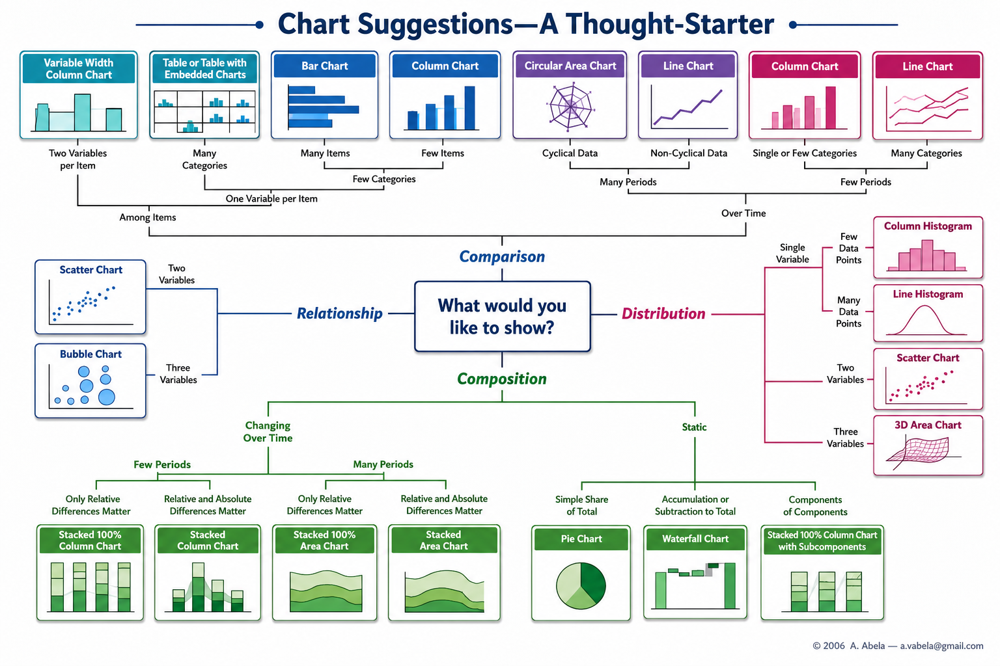
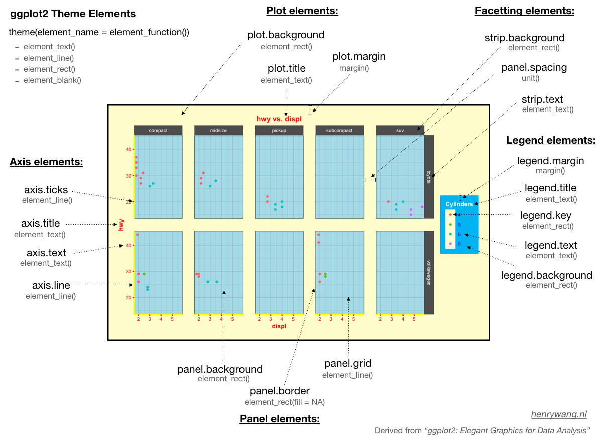

---
output:
  pdf_document:
    number_sections: yes
  html_document: default
editor_options: 
  chunk_output_type: console
---

```{r, include=FALSE, warning=FALSE,message=FALSE, echo=FALSE}
#load libraries and datasets
library(tidyverse)
library(gridExtra)
library(readxl)
library(tidyverse)
library(DescTools)


data <- haven::read_dta("Datasets/dt.dta")
data<-forcats::as_factor(data, only_labelled = T)

```

# Selection of Graphics for data presentation

The choice of visualization or graphics depends on the specific insights you want to communicate to your target audience. It is essential to ensure that the chosen visualization or graphics effectively represents your data and is easily understandable to your audience. The following chart summarizes how the data can be visualized on different situations.



The selection of suitable charts also depends on the type of the variables. The choice of charts for different variable types are as follows:

**Nominal Data:**

For nominal variables like Gender,ethnicity, province, etc, following charts can be of choice:

-   Bar chart
-   Pie chart
-   Tree map

**Ordinal Data:**

For ordinal variables consiting of categories with a meaningful order but without a consistent interval like education levels (High School, College, Graduate), Likert scale, following charts can be of choice.

-   Bar chart
-   Dot plot
-   Ordered bar chart

I**nterval Data:**

For numeric variables like Temperature (in Celsius or Fahrenheit), IQ scores, following charts can be of choice.

-   Line chart
-   Histogram
-   Box plot

**Ratio Data:**

For ratio scale variables like Height, Weight, Income etx, following charts can be of choice.

-   Scatter plot
-   Histogram
-   Box plot

**Time Series Data:**

For data points collected over time, following charts can be of choice.

-   Line chart
-   Area chart
-   Candlestick chart

**Hierarchical Data:**

For data with a nested structure, following charts can be of choice.

-   Treemap
-   Sunburst chart
-   Nesting in a bar or column chart

**Correlation and Relationships:**

To show relationships between two or more variables, we can select following charts.

-   Scatter plot
-   Bubble chart
-   Heatmap

**Distribution:**

To visualizing the spread of data, we can use following charts.

-   Histogram
-   Box plot
-   Kernel density plot

**Geospatial Data:**

To visualize data associated with geographical locations, following charts can be used.

-   Map
-   Choropleth map
-   Cartogram

**Comparison:**

To visualize comparison of values across different categories, we can use followinf charts.

-   Bar chart
-   Grouped bar chart
-   Stacked bar chart

### Graphics with ggplot

`ggplot()`, a function from ggplot2 package, allows us to plot simple to complex plots. Every ggplot2 plot have three important components

1.  Dataset in correct format
2.  A set of aesthetic mapping between variables in the data and visual properties: *x-axis, y-axis, color, fill color, shape, and size are the aesthetic attributes*
3.  At least one layer that describes how to render each observation
    1.  `geom_area()` draws an **area plot**, which is a line plot filled to the y-axis (filled lines). Multiple groups will be stacked on top of each other.
    2.  `geom_boxplot()` draws box plot
    3.  `geom_bar(stat = "identity")` makes a **bar chart**. We need `stat = "identity"` because the default stat automatically counts values . The identity stat leaves the data unchanged. Multiple bars in the same location will be stacked on top of one another.
    4.  `geom_line()` makes a **line plot**. The `group` aesthetic determines which observations are connected; connects points from left to right; `geom_path()` is similar but connects points in the order they appear in the data. Both `geom_line()` and `geom_path()` also understand the aesthetic `linetype`, which maps a categorical variable to solid, dotted and dashed lines.
    5.  `geom_point()` produces a **scatterplot**. `geom_point()` also understands the `shape` aesthetic.
    6.  `geom_polygon()` draws polygons, which are filled paths. Each vertex of the polygon requires a separate row in the data. It is often useful to merge a data frame of polygon coordinates with the data just prior to plotting.
    7.  `geom_text()` adds text to a plot. It requires a `label` aesthetic that provides the text to display, and has a number of parameters (`angle`, `family`, `fontface`, `hjust` and `vjust`) that control the appearance of the text.

### **Basics**

```{r}
head(data[, c("Age","Sex")],10)


#simple box plot of age by sex
ggplot(data = data,
       aes(x = Sex, y=Age))+
  geom_boxplot()
# here data is the dataset, x and y axis include sex and age respectively and layer include box plot

# lets add some other asthetics and see changes
#fill: it will create age distribution of population by sex and ethnicity (change the fill color)
ggplot(data = data,
       aes(x = Sex, y=Age, fill=Ethnicity))+
  geom_boxplot()


# see difference here  when you add specific color to fill and col attribute
ggplot(data = data,
       aes(x = Sex, y=Age, fill="red"))+
  geom_boxplot()
ggplot(data = data,
       aes(x = Sex, y=Age, col="red"))+
  geom_boxplot()


# add title and change axis title
ggplot(data = data,
       aes(x = Sex, y=Age, fill=Ethnicity))+
  geom_boxplot()+
  xlab("Gender")+
  ylab("Age (in years)")+
  labs(title = "Sex and ethnicity-wise distribution of Age",
       subtitle = "Caption here",tag = "A")


```

### **Manual color to the chart (fill and line color)**

```{r}
# change fill color by variable
ggplot(data = data,
       aes(x = Sex, y=Age, fill=Ethnicity))+
  geom_boxplot()+
  scale_fill_manual(values=c("lightpink","lightblue","lightyellow", "lightgreen","navy"))+
  xlab("Gender")+
  ylab("Age (in years)")+
  labs(title = "Sex and ethnicity-wise distribution of Age",
       subtitle = "Caption here",tag = "A")


# change line color by variable
ggplot(data = data,
       aes(x = Sex, y=Age, col=Ethnicity))+
  geom_boxplot()+
  scale_color_manual(values=c("lightpink","lightblue","lightyellow", "lightgreen","navy"))+
  xlab("Gender")+
  ylab("Age (in years)")+
  xlab("Gender") +
  ylab("Age (in years)") +
  labs(title = "Sex and ethnicity-wise distribution of Age",
       subtitle = "Caption here",tag = "A")
```

### Faceting

Faceting creates tables of graphics by splitting the data into subsets and displaying the same graph for each subset. There are two types of faceting- grid and wrap

{fig-align="center"}

```{r}

#facet wrap
ggplot(data = data,
       aes(x = Sex, y=Age, fill=Ethnicity))+
  geom_boxplot()+
  facet_wrap(facets = ~Ethnicity,nrow =3, scales = "free") # scales ("free", "free_x", "free_y")


#facet grid
ggplot(data = data,
       aes(x = Sex, y=Age, fill=Ethnicity))+
  geom_boxplot()+
  facet_grid(~Ethnicity, scales = "free") # scales ("free", "free_x", "free_y")

```

### **Change themes**

In order to change the themes, you first need to know the components of charts



Source: <https://henrywang.nl/ggplot2-theme-elements-demonstration/>

The theming system is composed of four main components:

1.  Theme **elements** specify the non-data elements that you can control.

    -   **General Appearance:**

        -   **`panel.background`**: Background color of the plotting area.

        -   **`plot.background`**: Background color of the entire plot.

        -   **`plot.title`**: Text appearance for the plot title.

        -   **`plot.subtitle`**: Text appearance for the plot subtitle.

    -   **Axis Labels and Title:**

        -   **`axis.title.x`** and **`axis.title.y`**: Text appearance for the x and y-axis titles.

        -   **`axis.text.x`** and **`axis.text.y`**: Text appearance for tick labels on the x and y-axes.

        -   **`axis.title`**: Text appearance for both x and y-axis titles simultaneously.

    -   **Axis Lines and Ticks:**

        -   **`axis.line`**: Line appearance for axis lines.

        -   **`axis.ticks`**: Line appearance for axis ticks.

        -   **`axis.text`**: Text appearance for axis tick labels.

    -   **Grid Lines:**

        -   **`panel.grid.major`** and **`panel.grid.minor`**: Line appearance for major and minor grid lines.

    -   **Legend:**

        -   **`legend.background`**: Background color of the legend.

        -   **`legend.title`**: Text appearance for the legend title.

        -   **`legend.text`**: Text appearance for legend labels.

    -   **Margins and Spacing:**

        -   **`plot.margin`**: Margins around the entire plot.

        -   **`panel.spacing`**: Spacing between panels if there are multiple facets.

    -   **Facet Labels:**

        -   **`strip.text`**: Text appearance for facet labels.

        -   **`strip.background`**: Background color of the facet labels.

2.  Each theme element is associated with an **element function**, which describes the visual properties of the element.

    -   **Background Elements:**

        -   **`element_blank()`**: Removes the element (e.g., removes the background or border).

        -   **`element_rect()`**: Customizes the appearance of rectangular elements.

    -   **Text Elements:**

        -   **`element_text()`**: Customizes the appearance of text elements.

    -   **Line Elements:**

        -   **`element_line()`**: Customizes the appearance of line elements.

    -   **Arrow Elements:**

        -   **`element_arrow()`**: Customizes the appearance of arrow elements.

    -   **Title Elements:**

        -   **`element_title()`**: Customizes the appearance of title elements.

    -   **Line Breaks and Wrapping:**

        -   **`element_markdown()`**: Allows using Markdown syntax for text elements.

    -   **Spacing Elements:**

        -   **`element_spacing()`**: Customizes the spacing between various elements.

    -   **Miscellaneous Elements:**

        -   **`element_grob()`**: Allows direct insertion of graphical objects.

        -   **`element_render()`** and **`element_render_args()`**: Used for rendering custom elements.

3.  The `theme()` function which allows you to override the default theme elements by calling element functions, like `theme(plot.title = element_text(colour = "red"))`.

4.  **Complete** **themes**

-   **`theme_minimal()`**: A minimalistic theme.

-   **`theme_light()`**: A light-colored theme.

-   **`theme_dark()`**: A dark-colored theme.

-   **`theme_classic()`**: A classic, gray-scale theme.

```{r}
ggplot(data = data,
       aes(x = Sex, y=Age, fill=Ethnicity))+
  geom_boxplot()+
  xlab("Gender")+
  ylab("Age (in years)")+
  labs(title = "Sex and ethnicity-wise distribution of Age",
       subtitle = "Caption here",tag = "A")+
  facet_wrap(facets = ~Ethnicity,nrow =3, scales = "free_x")+ # scales ("free", "free_x", "free_y")
  theme(panel.background=element_rect(fill="lightgreen"),
        panel.grid = element_blank(),
        plot.title = element_text(face="bold",color = "red", size = 13),
        axis.title = element_text(face="bold", color="blue"),
        legend.title =element_text(face="bold", color="pink"),
        legend.position = "bottom",
        axis.text=element_text(colour = "darkgreen"),
        axis.line=element_line(color="blue", linewidth = 1)
  )

```

## Example 1: Bar plot with CI

Lets create bar diagram from another dataset

```{r}
# load dataset
dt<-readRDS("Datasets/For graphics1.RDS")
# Prepare the aggregated pivot table
a<-dt |> 
  group_by(Province, Four_ANC) |> 
  tally() |> 
  mutate(total = sum(n),
         percent=n/total*100) |> 
  filter(Four_ANC=="Yes")

# plot bar diagram
ggplot(data=a)+
  geom_bar(aes(x=Province, y=percent), stat = "identity")

# lets add vaule label to the barplot


# Prepare the aggregated pivot table
a<-dt |> 
  group_by(Location,Province, Four_ANC) |> 
  tally() |> 
  ungroup() |>
  group_by(Location,Province) |> 
  mutate(total = sum(n),
         percent=n/total*100,
         ci=DescTools::BinomCI(n,total,method="clopper-pearson")*100) |> 
  filter(Four_ANC=="Yes")

# Generate bar_plot
ggplot(data=a)+
  geom_bar(aes(x=Location, y=percent), stat = "identity")
# what is wrong with this ????

# We have calculated percent for location under provicne too which is to be faceted
ggplot(data=a)+
  geom_bar(aes(x=Location, y=percent), stat = "identity")+
  facet_wrap(~Province, nrow = 1)


# Now lets add CI to the bar
ggplot(data=a)+
  geom_bar(aes(x=Location, y=percent), stat = "identity")+
  geom_errorbar(aes(x=Location, y=percent,ymin = a$ci[,2], ymax = a$ci[,3]), alpha = 1, size=1, width=0.3)+
  facet_wrap(~Province, nrow = 1)

#Now lets add value label the chart
ggplot(data=a)+
  geom_bar(aes(x=Location, y=percent,fill=Location),col="black", stat = "identity", alpha=1)+
  geom_errorbar(aes(x=Location, y=percent,ymin = a$ci[,2], ymax = a$ci[,3]), alpha = 1, size=1, width=0.3)+
  facet_wrap(~Province, nrow = 1)+
  geom_text(aes(x=Location, y=percent, label=sprintf("%0.2f",percent)), size=4, vjust=1.5,hjust=-0.1, angle=90, col="blue")+
  scale_fill_manual(values=c("pink","lightgreen"))+
  xlab("Location")+
  ylab("Percent (%) with CI")+
  labs(title = "Distribution of 4+ANC by Location and Provice")+
  theme(panel.background=element_blank(),
        panel.grid = element_blank(),
        plot.title = element_text(face="bold",color = "black", size = 13),
        axis.title = element_text(face="bold", color="black"),
        legend.title =element_text(face="bold", color="black"),
        legend.position = "bottom",
        axis.text=element_text(colour = "darkgreen"),
        axis.line=element_line(color="black", linewidth = 1)
  )
```

## Example 2: plot of chart from global burden of disease

```{r}
#load dataset
gbd <- readxl::read_excel("Datasets/For graphics2.xlsx", sheet = "dataset")

head(gbd, 10)


gbd$Age2<-factor(gbd$Age, levels = c("<1","1-4","5-9","10-14","15-19","20-24","25-29","30-34","35-39","40-44", "45-49","50-54","55-59","60-64","65-69","70+" ),labels= c("<1","1-4","5-9","10-14","15-19","20-24","25-29","30-34","35-39","40-44", "45-49","50-54","55-59","60-64","65-69","70+" ), ordered = T )

gbd$Class<-factor(gbd$Class, levels = c("DM", "DM1", "DM2"), labels = c("Diabetes Mellitus (Type-1 and Type-2 combined)", "Diabetes Mellitus (Type-1)","Diabetes Mellitus (Type-2)"))


prevalence<-gbd[gbd$Ovearll_class %in% c("DM_P", "DM1_P", "DM2_P"),]

death<-gbd[gbd$Ovearll_class %in% c("DM_D", "DM1_D", "DM2_D"),]
daly<-gbd[gbd$Ovearll_class %in% c("DM_Da", "DM1_Da", "DM2_Da"),]


c1<-ggplot(data = prevalence)+
  geom_bar(aes(x=Age2, y=prop, fill=Sex), stat = "identity", position = "dodge")+
  xlab("Age in years")+ylab("Prevalence ")+
  facet_wrap(~Class,nrow = 3,scales = "free_x")+
  theme(legend.position = "none",
        axis.title.x = element_text(size = 12,face = "bold"),
        axis.title.y=element_text(size=12, face="bold"),
        #strip.text = element_text(size=10, face="bold")
        strip.text=element_blank()
        )+

  coord_flip()


c2<-ggplot(data = death)+
  geom_bar(aes(x=Age2, y=prop, fill=Sex), stat = "identity", position = "dodge")+
  xlab("")+ylab("Deaths")+
  facet_wrap(~Class,nrow = 3,scales = "free_x")+
  theme(legend.position = "none",
        axis.title.x = element_text(size = 12,face = "bold"),
        axis.title.y=element_text(size=12, face="bold"),
        #strip.text = element_text(size=10, face="bold")
        strip.text=element_blank())+
  coord_flip()

c3<-ggplot(data = daly)+
  geom_bar(aes(x=Age2, y=prop, fill=Sex), stat = "identity", position = "dodge")+
  xlab("")+ylab("DAILYs")+
  facet_wrap(.~Class,nrow = 3,scales = "free_x",strip.position="right" , labeller = label_wrap_gen(multi_line = TRUE))+
  theme(legend.position = "none",
        axis.title.x = element_text(size = 12,face = "bold"),
        axis.title.y=element_text(size=12, face="bold"),
        strip.text = element_text(size=10, face="bold",hjust = 0.5)
        )+
  coord_flip()


grid.arrange(c1,c2,c3, ncol=3)


library(patchwork)

combined<-c1+c2+c3 & theme(legend.position = "top", legend.title = element_blank())

m<-combined + plot_layout(guides = "collect")
m

ggsave(filename = "Output/chartpdfff.pdf", plot = m, dpi = 300 , )
```

## Example 2: Plot of chart from global burden of disease

```{r}
gbd <- readxl::read_excel("Datasets/For graphics3.xlsx")


gbd$age_name<-factor(gbd$age_name, levels = c("<1 year","1-4 years","5-9 years","10-14 years","15-19 years","20-24 years","25-29 years","30-34 years","35-39 years","40-44 years","45-49 years","50-54 years","55-59 years","60-64 years","65-69 years","70-74 years","70+ years","75-79 years","80+ years","Age-standardized", "All ages"), labels = c("<1","1-4","5-9","10-14","15-19","20-24","25-29","30-34","35-39","40-44","45-49","50-54","55-59","60-64","65-69","70-74","70+","75-79","80+","Age-standardized", "All ages"), ordered = T)

gbd$cause_name<-as.factor(gbd$cause_name)
gbd$Year<-factor(gbd$year, levels = c(1990,1995,2000,2005,2010,2015,2019), labels = c("1990","1995","2000","2005","2010","2015","2019"), ordered = T)

gbd$sex_name<-as.factor(gbd$sex_name)


gbd$measure_id<-NULL; gbd$location_id<-NULL; gbd$sex_id<-NULL; gbd$age_id<-NULL; gbd$cause_id<-NULL;gbd$metric_id<-NULL; gbd$location_name<-NULL


gbd$ID<-paste(gbd$year,gbd$age_name,gbd$sex_name, gbd$cause_name, gbd$measure_name,sep = ".")


dataset<-gbd
daly<-dataset[dataset$measure_name=="DALYs (Disability-Adjusted Life Years)",]

deaths<-dataset[dataset$measure_name=="Deaths",]

prev<-dataset[dataset$measure_name=="Prevalence",]

yll<-dataset[dataset$measure_name=="YLLs (Years of Life Lost)",]
yld<-dataset[dataset$measure_name=="YLDs (Years Lived with Disability)",]


# age<-daly[daly$sex_name=="Both",]
# age<-age[age$age_name!="Age-standardized"& age$age_name!="All ages"& age$age_name!="70+",]
# age<-age[age$metric_name=="Number",]
# age<-age[age$cause_name!="Chronic kidney disease",]
# age<-age[age$year==1990|age$year==2019,]

age1<-daly[daly$sex_name=="Both",]
age1<-age1[age1$age_name!="Age-standardized"& age1$age_name!="All ages"&age1$age_name!="70+",]
age1<-age1[age1$metric_name=="Rate",]
age1<-age1[age1$cause_name!="Chronic kidney disease",]
age1<-age1[age1$year==1990|age1$year==2019,]


yll<-dataset[dataset$measure_name=="YLLs (Years of Life Lost)",]
yll2<-yll[yll$sex_name!="Both",]
yll2<-yll2[yll2$age_name=="Age-standardized"|yll2$age_name=="All ages",]
yll2<-yll2[yll2$metric_name=="Rate",]
yll2<-yll2[yll2$cause_name=="Chronic kidney disease",]


yld<-dataset[dataset$measure_name=="YLDs (Years Lived with Disability)",]
yld2<-yld[yld$sex_name!="Both",]
yld2<-yld2[yld2$age_name=="Age-standardized"|yld2$age_name=="All ages",]
yld2<-yld2[yld2$metric_name=="Rate",]
yld2<-yld2[yld2$cause_name=="Chronic kidney disease",]


# age2<-daly[daly$sex_name=="Both",]
# age2<-age2[age2$age_name!="Age-standardized"& age2$age_name!="All ages"& age2$age_name!="70+",]
# age2<-age2[age2$metric_name=="Percent",]
# age2<-age2[age2$cause_name!="Chronic kidney disease",]
# age2<-age2[age2$year==1990|age2$year==2019,]


dea<-deaths[deaths$sex_name=="Both",]
dea<-dea[dea$age_name!="Age-standardized"& dea$age_name!="All ages"& dea$age_name!="70+",]
dea<-dea[dea$metric_name=="Rate",]
dea<-dea[dea$cause_name!="Chronic kidney disease",]
dea<-dea[dea$year==1990|dea$year==2019,]

pe<-prev[prev$sex_name=="Both",]
pe<-pe[pe$age_name!="Age-standardized"& pe$age_name!="All ages"& pe$age_name!="70+",]
pe<-pe[pe$metric_name=="Rate",]
pe<-pe[pe$cause_name!="Chronic kidney disease",]
pe<-pe[pe$year==1990|pe$year==2019,]


#number DALY
a<-ggplot(data = pe)+
  geom_bar(aes(x=age_name, y=val, fill=cause_name),stat = "identity", position = "stack", size=0.01, color="black")+ ylab("Prevalence rate (per 100,000)")+xlab("")+
  scale_fill_manual(values=c("#9CD5E8", "#E69F00", "#00559C","#CD534C","#6BB43E"))+
  guides(fill=guide_legend(ncol=1))+
 facet_wrap(facets = .~Year)+
  theme(legend.position = c(0.19,0.75),
        axis.title.x = element_text(size = 14,face = "bold"),
        axis.title.y=element_text(size=14, face="bold"),
        axis.text.x = element_text(size=10, face="bold", angle = 45, hjust = 1),
        axis.text.y = element_text(size=10, face="bold"),
        strip.text = element_text(size=14, face="bold"),
        legend.text = element_text(size=8),
        legend.title = element_blank(),
        legend.background = element_blank())

# Percent daly
b<-ggplot(data = dea)+
  geom_bar(aes(x=age_name, y=val, fill=cause_name),stat = "identity", position = "stack",size=0.01, color="black")+ ylab("Death rate (per 100,000)")+xlab("")+
  scale_fill_manual(values=c("#9CD5E8", "#E69F00", "#00559C","#CD534C","#6BB43E"))+
  facet_wrap(facets = .~Year)+
  guides(fill=guide_legend(ncol=2))+
  theme(legend.position = "none",
        legend.text = element_blank(),
        axis.title.x = element_text(size = 14,face = "bold"),
        axis.title.y=element_text(size=14, face="bold"),
        axis.text.x = element_text(size=10, face="bold",angle = 45, hjust = 1),
        axis.text.y = element_text(size=10, face="bold"),
        strip.text = element_blank())

# Percent daly
c<-ggplot(data = age1)+
  geom_bar(aes(x=age_name, y=val, fill=cause_name),stat = "identity", position = "stack",size=0.01, color="black")+ ylab("DALY rate (per 100,000)")+xlab("Age (in years)")+
  scale_fill_manual(values=c("#9CD5E8","#E69F00", "#00559C","#CD534C","#6BB43E"))+
  facet_wrap(facets = .~Year)+
  guides(fill=guide_legend(ncol=2))+
  theme(legend.position = "none",
        legend.text = element_blank(),
        axis.title.x = element_text(size = 14,face = "bold"),
        axis.title.y=element_text(size=14, face="bold",),
        axis.text.x = element_text(size=10, face="bold", angle = 45, hjust = 1),
        axis.text.y = element_text(size=10, face="bold"),
        strip.text = element_blank())


library(patchwork)

m<-grid.arrange(a,b,c, ncol=1)

ggsave(filename = "Output/death_pre_daly.png", plot = m, dpi = 300 )

```

# Export chart from ggplot to pdf

You can directly export from the plot and also using the code specifying dpi using `ggsave()`

```{r, eval=FALSE, message=FALSE, warning=FALSE, }
ggsave(filename = "Output/chartpdfff.pdf", plot = m, dpi = 300 )
```

# **Plot maps with ggplot**

```{r}
# Read shape file
llmap<-sf::st_read("Datasets/Shape file of Nepal/Nepal_llmapcoded.shp")


ggplot(data = llmap)+
  geom_sf(aes(geometry=geometry), col="black")+
  coord_sf(crs = "WGS84")+
  theme(
    panel.background = element_blank(),
    legend.title = element_text(face="bold"),
    axis.title = element_blank(),
    axis.text = element_blank(),
    axis.ticks = element_blank()
  )

ggplot(data = llmap)+
  geom_sf(aes(geometry=geometry, fill=TYPE), col="black")+
  scale_fill_viridis_d()+
  coord_sf(crs = "WGS84")+
  theme(
    panel.background = element_blank(),
    legend.title = element_text(face="bold"),
    axis.title = element_blank(),
    axis.text = element_blank(),
    axis.ticks = element_blank()
  )

```

We will explain about mapping in later chapters in detail.
