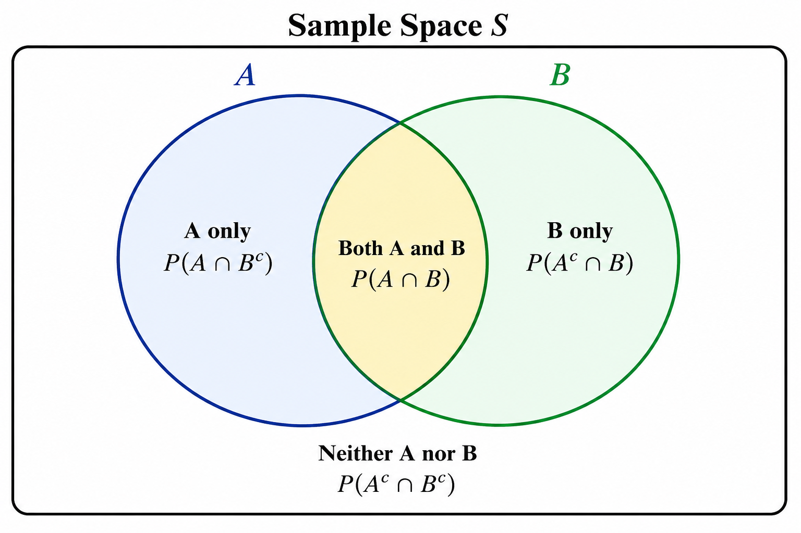
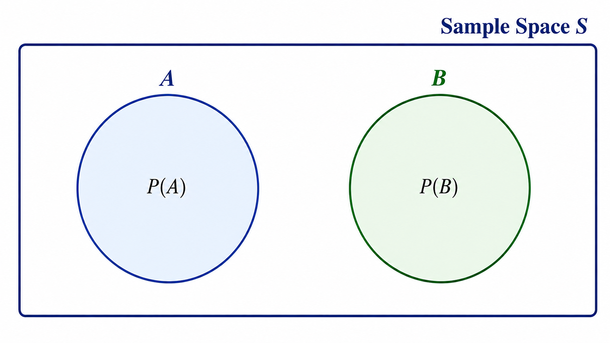
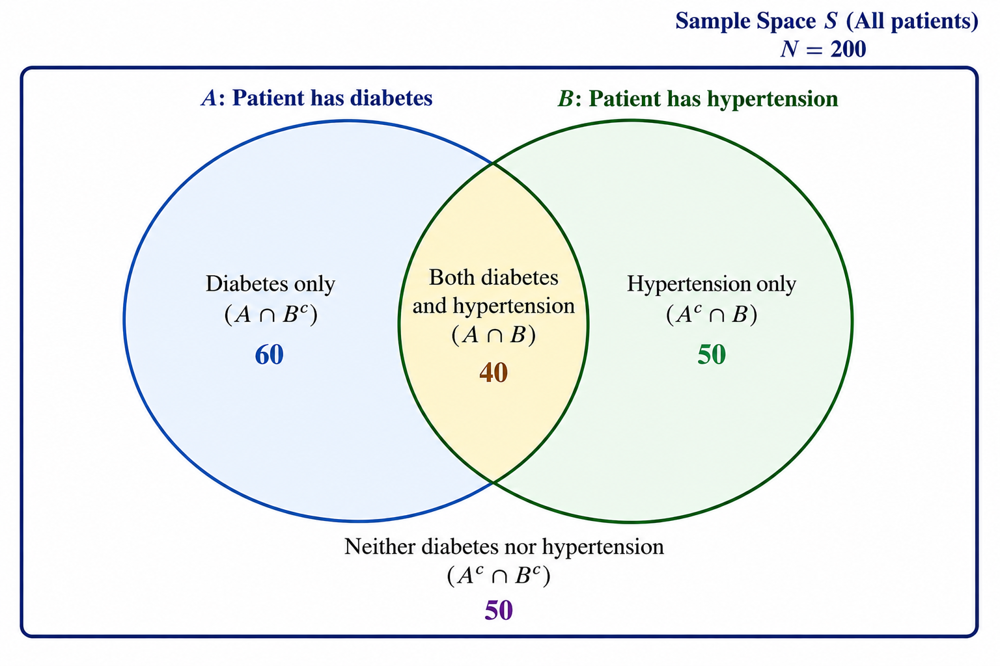

## Introduction

**Probability** is the mathematical language for quantifying uncertainty. Everything that follows in this book — hypothesis testing, confidence intervals, regression, diagnostic testing — rests on probability theory. In biostatistics, probability lets us answer questions such as: What is the chance that a patient with a positive screening test truly has the disease? What is the probability that a randomly selected newborn is preterm? How likely is it that an observed difference between treatment groups occurred by chance alone?

::: callout-note
**Definition:** Probability is a numerical measure, between 0 and 1 (or 0% and 100%), of the likelihood that a particular event will occur. A probability of 0 means the event is impossible; a probability of 1 means the event is certain.
:::

## Random Experiments

A **random experiment** is any process or procedure that can be repeated (at least conceptually) under the same conditions, whose individual outcome cannot be predicted with certainty, but whose set of *possible* outcomes is known in advance.

**Examples in public health:**

-   Testing a randomly selected patient for a disease (outcome: positive or negative).
-   Recording the number of new malaria cases in a district in one month.
-   Selecting a newborn and recording birth weight.
-   Administering a vaccine and observing whether the recipient develops an adverse reaction.

## Sample Space

The **sample space**, denoted $S$ or $\Omega$, is the set of **all possible outcomes** of a random experiment.

**Examples:**

-   Testing a patient for a disease: $S = \{\text{Positive}, \text{Negative}\}$.
-   Rolling a die to randomly assign a patient to 1 of 6 study arms: $S=\{1,2,3,4,5,6\}$.
-   Recording the number of hospital-acquired infections in a month: $S = \{0,1,2,3,\ldots\}$ (a countably infinite sample space).
-   Measuring a patient's temperature: $S = (\text{all real numbers in a plausible physiological range})$, a continuous sample space.

## Events

An **event** is any subset of the sample space — a collection of one or more outcomes we are interested in. Events are typically denoted with capital letters ($A$, $B$, $C$, ...).

**Example:** In the die-rolling experiment for assigning patients to 6 study arms, let $A$ = "patient assigned to an even-numbered arm" $= \{2,4,6\}$.

### Types of Events

-   **Simple (elementary) event:** Consists of exactly one outcome, e.g., $\{3\}$.
-   **Compound event:** Consists of more than one outcome, e.g., $\{2,4,6\}$.
-   **Certain event:** The entire sample space $S$; probability = 1.
-   **Impossible event:** The empty set $\emptyset$; probability = 0.
-   **Complementary event (**$A^c$ or $\bar{A}$): All outcomes in $S$ that are *not* in $A$. $P(A^c) = 1-P(A)$.
-   **Mutually exclusive (disjoint) events:** Two events that cannot occur at the same time, i.e., $A \cap B = \emptyset$.
-   **Independent events:** The occurrence of one event does not affect the probability of the other.
-   **Dependent events:** The occurrence of one event changes the probability of the other.

## Probability Axioms (Kolmogorov's Axioms)

For any event $A$ in sample space $S$:

1.  **Non-negativity:** $P(A) \ge 0$ for every event $A$.
2.  **Normalization:** $P(S) = 1$ (something in the sample space must happen).
3.  **Additivity:** For any two **mutually exclusive** events $A$ and $B$: $P(A \cup B) = P(A) + P(B)$. (More generally, for a countable sequence of mutually exclusive events, the probability of their union is the sum of their probabilities.)

From these three axioms, all other probability rules can be derived, including $P(A^c) = 1 - P(A)$ and $0 \le P(A) \le 1$.

## Three Approaches to Assigning Probability

### 1. Classical (A Priori) Probability

Applies when all outcomes in the sample space are **equally likely**. $$P(A) = \frac{\text{Number of outcomes favorable to } A}{\text{Total number of outcomes in } S}$$

**Worked example:** A study randomizes patients to one of 4 equally likely treatment arms. The probability a given patient is assigned to Arm 1 is $P(\text{Arm 1}) = 1/4 = 0.25$.

### 2. Empirical (Relative Frequency) Probability

Based on **observed data** from repeated trials or historical records, rather than theoretical assumptions. $$P(A) = \frac{\text{Number of times } A \text{ occurred}}{\text{Total number of trials observed}}$$

**Worked example (clinical):** Among 500 patients who underwent a particular surgery at a hospital last year, 15 developed a post-operative infection. The empirical probability of infection is: $$P(\text{infection}) = \frac{15}{500} = 0.03 = 3\%$$

This is exactly how incidence proportions/risk are calculated in epidemiology.

### 3. Subjective Probability

Based on **personal judgment, experience, or belief**, used when neither equally likely outcomes nor sufficient historical data are available.

**Example:** A clinician estimates "I believe there is about a 70% chance this patient's symptoms are due to a viral rather than bacterial infection," based on clinical experience rather than a formal calculation. Subjective probability underlies **prior probabilities** in Bayesian analysis (Sections 5–6).

## Venn Diagrams

Venn diagrams visually represent relationships between events (sets) within a sample space. Below, regions are labeled to show set relationships; overlapping regions represent intersections.

### General Two-Event Venn Diagram

{width="502"}

### Mutually Exclusive Events (No Overlap)



Because $A$ and $B$ share no outcomes, there is no overlapping region — this is the defining feature of mutually exclusive events.

### Clinical Example Venn Diagram

Let $A$ = "patient has diabetes" and $B$ = "patient has hypertension" in a clinic population of 200 patients: 60 have diabetes only, 50 have hypertension only, 40 have both, and 50 have neither.

{width="654"}

From this diagram:

$P(\text{diabetes}) = (60+40)/200 = 0.50$;

$P(\text{hypertension}) = (50+40)/200=0.45$;

$P(\text{both}) = 40/200 = 0.20$; $P(\text{neither}) = 50/200=0.25$.

## The Addition Rule

### General Addition Rule

$$P(A \cup B) = P(A) + P(B) - P(A \cap B)$$

We subtract $P(A \cap B)$ to avoid double-counting outcomes that belong to both events.

### Addition Rule for Mutually Exclusive Events

If $A$ and $B$ are mutually exclusive ($P(A \cap B) = 0$): $$P(A \cup B) = P(A) + P(B)$$

### Worked Example

Using the clinic data above ($n=200$): What is the probability a randomly selected patient has diabetes **or** hypertension (or both)?

**Step 1.** $P(A) = P(\text{diabetes}) = 100/200 = 0.50$ (60 diabetes-only + 40 both).

**Step 2.** $P(B) = P(\text{hypertension}) = 90/200 = 0.45$ (50 hypertension-only + 40 both).

**Step 3.** $P(A \cap B) = 40/200 = 0.20$.

**Step 4.** Apply the addition rule: $$P(A \cup B) = 0.50+0.45-0.20 = 0.75$$

**Verification by direct count:** $(60+50+40)/200 = 150/200 = 0.75$ ✓. This confirms 75% of patients have at least one of the two conditions.

## Mutually Exclusive Events

Two events $A$ and $B$ are **mutually exclusive (disjoint)** if they cannot both occur simultaneously: $P(A \cap B) = 0$.

**Clinical example:** A patient's ABO blood type result is a single test outcome — a patient cannot simultaneously be "type A" and "type B" (ignoring rare chimerism); these are mutually exclusive events.

## Independent vs. Dependent Events

### Independent Events

Two events are **independent** if the occurrence of one does not change the probability of the other: $$P(A \cap B) = P(A) \times P(B) \quad \text{(Multiplication Rule for independent events)}$$ Equivalently, $A$ and $B$ are independent if $P(A|B) = P(A)$.

**Worked example:** The sex of a first-born child and the sex of a second-born child (in the absence of any biological linkage) are independent. If $P(\text{boy}) = 0.5$ for each birth, then: $$P(\text{both children are boys}) = 0.5 \times 0.5 = 0.25$$

### Dependent Events

Two events are **dependent** if the occurrence of one **does** affect the probability of the other. In this case, we must use **conditional probability**: $$P(A \cap B) = P(A) \times P(B|A) \quad \text{(General/Multiplication Rule)}$$

**Clinical example:** Smoking status and lung cancer diagnosis are dependent events — knowing a patient smokes changes the probability that they will be diagnosed with lung cancer.

## Conditional Probability

### Definition

**Conditional probability** is the probability that event $B$ occurs, *given that* event $A$ has already occurred (or is known to be true).

### Formula

$$P(B|A) = \frac{P(A \cap B)}{P(A)}, \quad \text{provided } P(A) > 0$$

### Worked Example (Clinical)

Using the clinic data ($n=200$: 60 diabetes only, 50 hypertension only, 40 both, 50 neither): What is the probability a patient has hypertension, **given** that they have diabetes?

**Step 1.** $P(\text{diabetes}) = 100/200 = 0.50$. **Step 2.** $P(\text{diabetes} \cap \text{hypertension}) = 40/200 = 0.20$. **Step 3.** Apply the formula: $$P(\text{hypertension}|\text{diabetes}) = \frac{0.20}{0.50} = 0.40$$

**Interpretation:** Among diabetic patients, 40% also have hypertension — noticeably higher than the overall prevalence of hypertension in the whole clinic (45%... actually let's compare correctly: overall $P(\text{hypertension})=0.45$). Here conditioning on diabetes gives 40%, close to but not equal to the unconditional 45%, illustrating how conditioning can shift a probability up, down, or leave it nearly unchanged depending on the strength of association between the two conditions.

## The Multiplication Rule

### General Rule (Dependent Events)

$$P(A \cap B) = P(A)\times P(B|A)$$

### Special Case (Independent Events)

$$P(A \cap B) = P(A) \times P(B)$$

### Worked Example: Sequential (Dependent) Sampling

A batch of 10 vaccine vials contains 2 defective vials. Two vials are selected **without replacement** for quality testing. What is the probability both are defective?

**Step 1.** $P(\text{1st defective}) = 2/10 = 0.20$.

**Step 2.** Given the 1st is defective, 1 defective vial remains out of 9: $P(\text{2nd defective}|\text{1st defective}) = 1/9 = 0.111$.

**Step 3.** Apply the multiplication rule: $$P(\text{both defective}) = 0.20 \times 0.111 = 0.0222 \approx 2.2\%$$

## Tree Diagrams

Tree diagrams visually organize sequential/conditional probabilities and are especially useful for multi-stage experiments (they will be used again for diagnostic testing in Section 5).

```{mermaid}
flowchart LR
    Start(("Select<br/>Vial 1")) -->|"P = 0.20<br/>Defective"| D1["1st Defective"]
    Start -->|"P = 0.80<br/>Not Defective"| ND1["1st OK"]
    D1 -->|"P = 1/9<br/>Defective"| D1D2["Both Defective<br/>P = 0.20 × 0.111 = 0.022"]
    D1 -->|"P = 8/9<br/>Not Defective"| D1ND2["1st Def, 2nd OK<br/>P = 0.20 × 0.889 = 0.178"]
    ND1 -->|"P = 2/9<br/>Defective"| ND1D2["1st OK, 2nd Def<br/>P = 0.80 × 0.222 = 0.178"]
    ND1 -->|"P = 7/9<br/>Not Defective"| ND1ND2["Neither Defective<br/>P = 0.80 × 0.778 = 0.622"]
```

**Check:** The four end-branch probabilities should sum to 1: $0.022+0.178+0.178+0.622 = 1.000$ ✓.

## Worked Example Combining Multiple Rules (Clinical)

In a population, 10% of people have a certain risk gene ($G$). Among those with the gene, 40% develop the disease ($D$) by age 60; among those without the gene, only 5% develop the disease. Find the overall probability a randomly selected person develops the disease (this previews the **Law of Total Probability**, essential for Bayes' Theorem in Section 5).

```{mermaid}
flowchart LR
    Start(("Population")) -->|"P(G) = 0.10"| G["Has Gene"]
    Start -->|"P(Gᶜ) = 0.90"| Gc["No Gene"]
    G -->|"P(D|G) = 0.40"| GD["Gene & Disease<br/>P = 0.10×0.40 = 0.04"]
    G -->|"P(Dᶜ|G) = 0.60"| GDc["Gene, No Disease<br/>P = 0.10×0.60 = 0.06"]
    Gc -->|"P(D|Gᶜ) = 0.05"| GcD["No Gene, Disease<br/>P = 0.90×0.05 = 0.045"]
    Gc -->|"P(Dᶜ|Gᶜ) = 0.95"| GcDc["No Gene, No Disease<br/>P = 0.90×0.95 = 0.855"]
```

**Step 1.** Multiply along each branch (multiplication rule for dependent events): $P(G \cap D) = 0.04$, $P(G^c \cap D) = 0.045$. **Step 2.** Since "has gene" and "no gene" are mutually exclusive and exhaustive, add the two paths that end in disease (addition rule): $$P(D) = P(G\cap D) + P(G^c \cap D) = 0.04+0.045 = 0.085 = 8.5\%$$

This is the **Law of Total Probability**: $P(D) = P(D|G)P(G) + P(D|G^c)P(G^c)$.

# Bayes' Theorem

## Conditional Probability Review

Recall from Section 4 that conditional probability is defined as: $$P(B|A) = \frac{P(A\cap B)}{P(A)}$$

By symmetry, we can also write: $$P(A|B) = \frac{P(A\cap B)}{P(B)} \implies P(A\cap B) = P(A|B)\,P(B)$$

Setting the two expressions for $P(A \cap B)$ equal to each other gives us the foundation for Bayes' Theorem: $$P(B|A)\,P(A) = P(A|B)\,P(B)$$

## Bayes' Rule - Derivation

Starting from $P(B|A)\,P(A) = P(A|B)\,P(B)$, divide both sides by $P(A)$:

$$P(B|A) = \frac{P(A|B)\,P(B)}{P(A)}$$

This is **Bayes' Theorem**. In words: it lets us "reverse" a conditional probability — converting $P(A|B)$ (which we may know) into $P(B|A)$ (which we actually want to know).

If $P(A)$ is not known directly, it can be expanded using the **Law of Total Probability** (introduced in Section 4), assuming $B$ and $B^c$ partition the sample space: $$P(A) = P(A|B)\,P(B) + P(A|B^c)\,P(B^c)$$

giving the most commonly used form of Bayes' Theorem:

$$\boxed{P(B|A) = \frac{P(A|B)\,P(B)}{P(A|B)\,P(B) + P(A|B^c)\,P(B^c)}}$$

### Interpretation

Bayes' Theorem updates our belief about event $B$ (e.g., "patient has disease") after observing evidence $A$ (e.g., "test result is positive"), by combining:

-   $P(B)$ : the **prior probability** of $B$ (what we believed before seeing the evidence),
-   $P(A|B)$ : the **likelihood** of observing the evidence if $B$ is true,

to produce $P(B|A)$ — the **posterior probability** of $B$ after seeing the evidence. This prior/likelihood/posterior framework is developed further in Section 6.

## Applications: Medical Diagnosis and Screening Tests

Bayes' Theorem is the mathematical backbone of **diagnostic testing** in medicine and **screening program evaluation** in public health. It answers the clinically crucial question: *"Given that this patient tested positive, what is the probability they actually have the disease?"* — which is generally **not** the same as the test's sensitivity.

### The Confusion Matrix

Diagnostic test performance is organized in a **2×2 confusion matrix (contingency table)**, cross-classifying the true disease status against the test result:

|                        | Disease Present (D+) | Disease Absent (D−) | Total   |
|-------------------|------------------|------------------|------------------|
| **Test Positive (T+)** | True Positive (TP)   | False Positive (FP) | TP + FP |
| **Test Negative (T−)** | False Negative (FN)  | True Negative (TN)  | FN + TN |
| **Total**              | TP + FN              | FP + TN             | $N$     |

-   **False positive:** Test says positive, but the patient does not actually have the disease (a "false alarm").
-   **False negative:** Test says negative, but the patient actually has the disease (a "missed case").

### Key Diagnostic Test Measures

| Measure | Formula | Meaning |
|------------------------|------------------------|------------------------|
| **Sensitivity** (True Positive Rate) | $\dfrac{TP}{TP+FN}$ | Among those **with** disease, proportion correctly identified as positive |
| **Specificity** (True Negative Rate) | $\dfrac{TN}{TN+FP}$ | Among those **without** disease, proportion correctly identified as negative |
| **Positive Predictive Value (PPV)** | $\dfrac{TP}{TP+FP}$ | Among those who **test positive**, proportion who truly have disease |
| **Negative Predictive Value (NPV)** | $\dfrac{TN}{TN+FN}$ | Among those who **test negative**, proportion who truly do not have disease |
| **Prevalence** | $\dfrac{TP+FN}{N}$ | Proportion of the population with disease |
| **Positive Likelihood Ratio (LR+)** | $\dfrac{\text{Sensitivity}}{1-\text{Specificity}}$ | How much a positive result increases the odds of disease |
| **Negative Likelihood Ratio (LR−)** | $\dfrac{1-\text{Sensitivity}}{\text{Specificity}}$ | How much a negative result decreases the odds of disease |

::: callout-important
**Sensitivity and specificity are intrinsic properties of the test** and do not depend on disease prevalence. **PPV and NPV, however, depend heavily on prevalence** — the same test performs very differently (in terms of PPV) in a high-prevalence population (e.g., a specialist referral clinic) versus a low-prevalence population (e.g., mass community screening). This is precisely why Bayes' Theorem is required to move from sensitivity/specificity to PPV/NPV.
:::

## Worked Example: Full Manual Calculation

A tuberculosis (TB) screening test has **sensitivity = 90%** and **specificity = 95%**. It is used to screen a population where the true **prevalence of TB is 1%**. Suppose we screen $N = 10{,}000$ people. Find the PPV and NPV, and interpret using Bayes' Theorem.

**Step 1: Determine the number with and without disease using prevalence:** $$\text{Diseased} = 0.01 \times 10{,}000 = 100 \qquad \text{Not diseased} = 9900$$

**Step 2: Apply sensitivity to the diseased group:** $$TP = 0.90 \times 100 = 90 \qquad FN = 100-90=10$$

**Step 3: Apply specificity to the non-diseased group:** $$TN = 0.95\times 9900 = 9405 \qquad FP = 9900-9405=495$$

**Step 4: Completed confusion matrix:**

|       | D+  | D−   | Total  |
|-------|-----|------|--------|
| T+    | 90  | 495  | 585    |
| T−    | 10  | 9405 | 9415   |
| Total | 100 | 9900 | 10,000 |

**Step 5: Calculate PPV using Bayes' Theorem:** $$PPV = P(D+|T+) = \frac{P(T+|D+)P(D+)}{P(T+|D+)P(D+)+P(T+|D-)P(D-)} $$ $$= \frac{(0.90)(0.01)}{(0.90)(0.01)+(0.05)(0.99)}$$ $$PPV = \frac{0.009}{0.009+0.0495} = \frac{0.009}{0.0585} = 0.1538 \approx 15.4\%$$

**Verification from the confusion matrix:** $PPV = TP/(TP+FP) = 90/585 = 0.1538$

**Step 6: Calculate NPV:** $$NPV = \frac{TN}{TN+FN} = \frac{9405}{9415} = 0.9989 \approx 99.9\%$$

### Interpretation

Even with a "good" test (90% sensitive, 95% specific), because TB prevalence is low (1%), only about **15.4%** of people who test positive actually have TB — the majority of positives (84.6%) are **false positives**. This counterintuitive result is one of the most important lessons in diagnostic testing and is a direct consequence of Bayes' Theorem: **low prevalence sharply lowers PPV**, even for tests with high sensitivity and specificity. In contrast, the NPV is excellent (99.9%), a negative result is highly reassuring in this low-prevalence setting.

### Likelihood Ratios (Worked Calculation)

$$LR+ = \frac{\text{Sensitivity}}{1-\text{Specificity}} = \frac{0.90}{1-0.95} = \frac{0.90}{0.05} = 18$$ $$LR- = \frac{1-\text{Sensitivity}}{\text{Specificity}} = \frac{1-0.90}{0.95} = \frac{0.10}{0.95} = 0.105$$

**Interpretation:** A positive result is 18 times more likely in a person with TB than without — a strong LR+ (values \> 10 are considered to provide strong evidence). A negative result's LR− of 0.105 substantially reduces the likelihood of disease (values \< 0.1 are considered strong evidence against disease).

## Bayes' Theorem Flowchart (Diagnostic Testing)

```{mermaid}
flowchart TD
    Pop(("Population<br/>N = 10,000<br/>Prevalence = 1%")) --> D["Diseased<br/>n = 100"]
    Pop --> ND["Not Diseased<br/>n = 9,900"]
    D -->|"Sensitivity = 90%"| TP["True Positive<br/>n = 90"]
    D -->|"1 - Sensitivity = 10%"| FN["False Negative<br/>n = 10"]
    ND -->|"1 - Specificity = 5%"| FP["False Positive<br/>n = 495"]
    ND -->|"Specificity = 95%"| TN["True Negative<br/>n = 9,405"]
    TP --> PPV["PPV = 90 / (90+495) = 15.4%"]
    FP --> PPV
    TN --> NPV["NPV = 9405 / (9405+10) = 99.9%"]
    FN --> NPV
```

## Additional Worked Example: Public Health Screening Program Comparison

Compare the same test (sensitivity 90%, specificity 95%) used in two settings: (1) general community screening, prevalence = 1%; (2) a high-risk clinic (e.g., HIV-positive patients, close TB contacts), prevalence = 20%.

**Setting 2 calculation (prevalence = 20%, per 10,000 screened):**

**Step 1.** Diseased $= 0.20\times10{,}000=2000$; Not diseased $=8000$.

**Step 2.** $TP = 0.90\times2000=1800$; $FN=200$.

**Step 3.** $TN=0.95\times8000=7600$; $FP=400$.

**Step 4.** $PPV = 1800/(1800+400) = 1800/2200 = 0.818 = 81.8\%$.

| Setting             | Prevalence | PPV   | NPV                       |
|---------------------|------------|-------|---------------------------|
| Community screening | 1%         | 15.4% | 99.9%                     |
| High-risk clinic    | 20%        | 81.8% | 97.4% (calc: $7600/7800$) |

::: callout-tip
This is why public health screening programs **target high-risk subgroups** rather than screening entire low-prevalence populations indiscriminately, PPV improves dramatically as prevalence rises, even with an unchanged test.
:::

# Bayesian Inference

Section 5 applied Bayes' Theorem to a binary event (disease present/absent). **Bayesian inference** generalizes this idea to estimate unknown **parameters** (like a population proportion or mean), treating them not as fixed unknown constants (as in frequentist statistics) but as quantities with their own probability distributions that get updated as data accumulate.

## The Core Components

### Prior

The **prior distribution**, $P(\theta)$, represents our belief about a parameter $\theta$ **before** observing the current data. It may come from previous studies, expert opinion, or be deliberately "uninformative" (flat) if little is known in advance.

### Likelihood

The **likelihood**, $P(\text{data}|\theta)$, quantifies how probable the observed data are, for each possible value of the parameter $\theta$. It is the same likelihood function used in classical (frequentist) statistics, e.g., in maximum likelihood estimation.

### Posterior

The **posterior distribution**, $P(\theta|\text{data})$, represents our updated belief about $\theta$ **after** combining the prior with the observed data, via Bayes' Theorem:

$$P(\theta|\text{data}) = \frac{P(\text{data}|\theta)\,P(\theta)}{P(\text{data})} \propto P(\text{data}|\theta)\,P(\theta)$$

In words: **Posterior** $\propto$ Likelihood $\times$ Prior. The denominator $P(\text{data})$ is a normalizing constant (the marginal probability of the data, integrated/summed over all possible $\theta$) that ensures the posterior is a valid probability distribution.

### Posterior Predictive Distribution

The **posterior predictive distribution** is the probability distribution of a **new, not-yet-observed** data point, averaged over the uncertainty in the parameter as captured by the posterior distribution: $$P(\tilde{y}|\text{data}) = \int P(\tilde{y}|\theta)\,P(\theta|\text{data})\,d\theta$$

Unlike a frequentist prediction that plugs in a single point estimate of $\theta$, the posterior predictive distribution properly accounts for **both** the inherent randomness in new data **and** our remaining uncertainty about $\theta$ itself — typically giving wider, more honest prediction intervals.

## Simple Numerical Example — Estimating a Disease Prevalence

A researcher wants to estimate the prevalence ($\theta$) of a rare infection in a village. Based on similar villages studied previously, the researcher's **prior belief** is centered around 10% prevalence, formalized as a Beta distribution: $\theta \sim \text{Beta}(2, 18)$ (prior mean $= 2/(2+18) = 0.10$).

A sample of $n = 50$ villagers is tested, and $x = 8$ test positive (this is the **data/likelihood**, modeled as Binomial).

**Step 1: Prior:** $\text{Beta}(\alpha=2, \beta=18)$, prior mean $=0.10$.

**Step 2: Likelihood:** Binomial with $x=8$ successes out of $n=50$.

**Step 3: Posterior:** For a Binomial likelihood with a Beta prior (a "conjugate prior" pair), the posterior is also Beta, with parameters updated simply by adding the observed successes/failures: $$\theta|\text{data} \sim \text{Beta}(\alpha + x,\ \beta + n - x) = \text{Beta}(2+8,\ 18+42) = \text{Beta}(10, 60)$$

**Step 4: Posterior mean:** $$E[\theta|\text{data}] = \frac{10}{10+60} = \frac{10}{70} = 0.143 = 14.3\%$$

**Interpretation:** The posterior mean (14.3%) lies between the prior mean (10%) and the raw sample proportion ($8/50=16\%$). The Bayesian estimate is a **weighted compromise** between prior belief and observed data, with the weight determined by the relative "strength" (sample size) of the prior versus the new data. As more data accumulate, the posterior increasingly reflects the observed data and less the prior.

## Frequentist vs. Bayesian Comparison

| Aspect | Frequentist | Bayesian |
|------------------------|------------------------|------------------------|
| View of parameters | Fixed, unknown constants | Random variables with a probability distribution |
| Uses prior information? | No | Yes, explicitly via the prior distribution |
| Key output | Point estimate + confidence interval + p-value | Posterior distribution (full distribution of belief) |
| Interval interpretation | 95% CI: if we repeated the study infinitely, 95% of such intervals would contain the true parameter | 95% Credible Interval: there is a 95% probability the true parameter lies in this interval, given the data and prior |
| Probability interpretation | Long-run frequency of repeatable events | Degree of belief/uncertainty, updatable with new evidence |
| Handles small samples/rare events well? | Can struggle (e.g., wide, unstable CIs) | Can incorporate prior knowledge to stabilize estimates |
| Computational approach | Closed-form formulas, hypothesis tests | Often requires simulation (e.g., MCMC) for complex models |

::: callout-tip
The **frequentist confidence interval** and the **Bayesian credible interval** often look numerically similar (especially with large samples and uninformative priors), but their *interpretations* are fundamentally different. The Bayesian interpretation: "there is a 95% probability the parameter lies in this range" is usually closer to what people *intuitively* (though incorrectly, in the frequentist framework) assume a confidence interval means. This distinction is revisited in Section 11.
:::

## Applications in Epidemiology

-   **Disease surveillance:** Updating estimated outbreak size or reproduction number ($R_t$) in real time as new case data arrive, using previous estimates as priors.
-   **Diagnostic test evaluation:** Combining sparse validation data with prior information from similar tests to estimate sensitivity/specificity, especially useful when validation samples are small.
-   **Meta-analysis:** Hierarchical Bayesian models combine evidence across multiple studies, treating study-specific effects as drawn from a common prior distribution.
-   **Clinical trial monitoring:** Bayesian adaptive designs update the probability that a treatment is superior as data accrue, allowing trials to stop early for efficacy or futility.
-   **Small-area health estimation:** Bayesian smoothing (e.g., disease mapping) borrows strength from neighboring regions as priors to stabilize rate estimates in small populations, where raw rates would be highly unstable.

## Summary

-   A random experiment has a defined **sample space**; **events** are subsets of that space.
-   The three **probability axioms** (non-negativity, normalization, additivity) form the mathematical foundation of all probability rules.
-   Probability can be assigned via the **classical**, **empirical**, or **subjective** approach depending on the situation.
-   The **addition rule** combines "or" probabilities; subtract the intersection unless events are mutually exclusive.
-   The **multiplication rule** combines "and" probabilities; use conditional probability unless events are independent.
-   **Conditional probability**, $P(B|A) = P(A\cap B)/P(A)$, is the gateway to Bayes' Theorem, covered next in Section 5.
-   Bayes' Theorem, $P(B|A) = \dfrac{P(A|B)P(B)}{P(A)}$, lets us "reverse" a conditional probability using the prior probability and likelihood.
-   In diagnostic testing, Bayes' Theorem converts **sensitivity/specificity** (properties of the test) into **PPV/NPV** (what clinicians and patients actually want to know), and critically depends on **disease prevalence**.
-   **Sensitivity and specificity are independent of prevalence; PPV and NPV are not.**
-   **Likelihood ratios** summarize how much a test result shifts the probability of disease, independent of prevalence, and can be combined with pre-test odds to get post-test odds.
-   Bayesian inference combines a **prior** belief with the **likelihood** of observed data to produce a **posterior** distribution: Posterior $\propto$ Likelihood $\times$ Prior.
-   The **posterior predictive distribution** forecasts new data while properly accounting for parameter uncertainty.
-   Bayesian and frequentist approaches often agree numerically with large samples and weak priors, but differ fundamentally in interpretation and in their ability to formally incorporate prior information.
-   Bayesian methods are increasingly used in epidemiology for surveillance, small-area estimation, and adaptive clinical trial design.
