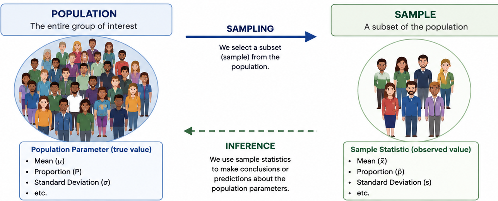
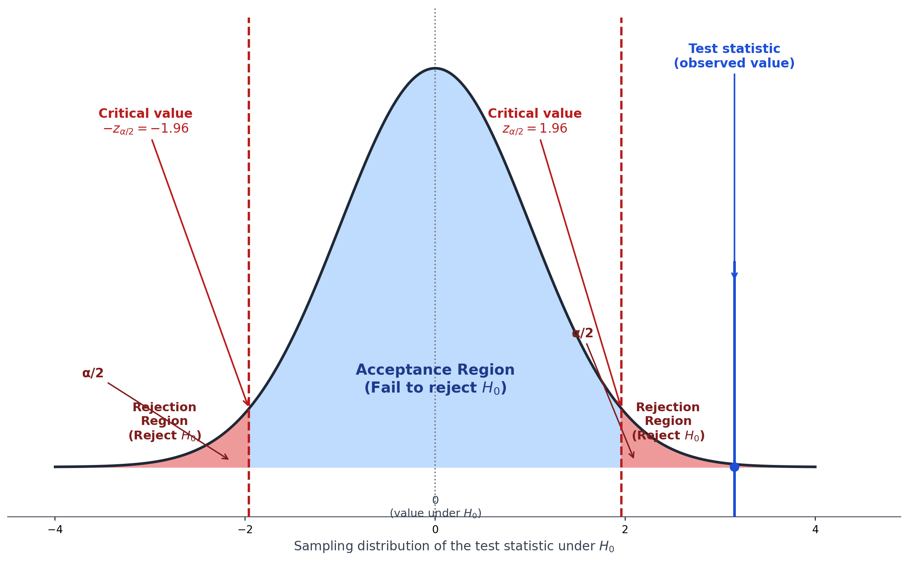
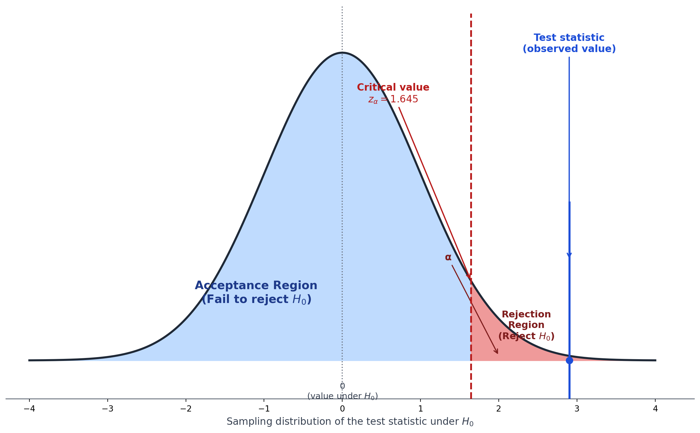
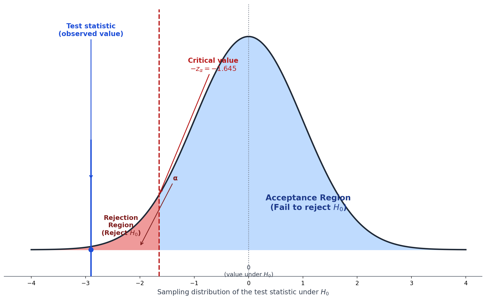
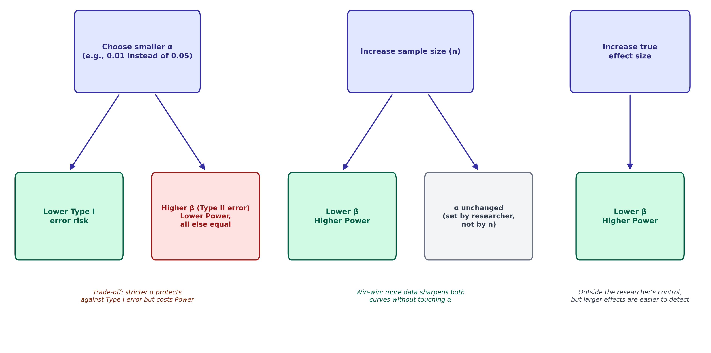
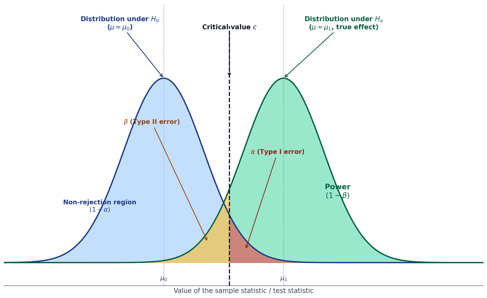

```{r, include=FALSE}
knitr::opts_knit$set(root.dir = "D:/Epi Biostat with R/Biostat_with_R/")
data <- readxl::read_excel("D:/Epi Biostat with R/Biostat_with_R/Environment/Datasets/wcgs.xls")
```

# Introduction {#sec-hypothesis_testing}

We have gone through descriptive statistics and probability distributions.
Now its turn to **inferential statistics**.
It is used to draw conclusions about a population from sample data.
**Hypothesis testing** is a formal procedure for deciding whether sample data provide enough evidence to support a claim about a population.

## Population Parameter vs. Sample Statistic

**Population** and the **sample** are two of the most fundamental concepts in statistics.
A **population parameter** (e.g., $\mu$, $\sigma$, $\pi$) is a fixed, usually unknown, numerical characteristic of an entire population.
A **sample statistic** (e.g., $\bar{x}$, $s$, $\hat{p}$) is computed from sample data and used to estimate the corresponding parameter.
Hypothesis testing uses sample statistic, together with its known sampling distribution, to make a probabilistic statement about the population parameter.



## Research Hypothesis, Null, and Alternative Hypothesis

-   **Research hypothesis:** The substantive question or claim the investigator wants to evaluate (e.g., "a new anti-hypertensive drug lowers blood pressure more than the standard drug").

-   **Null hypothesis (**$H_0$): A statement of "no effect," "no difference," or "no association" .It is the default position that is assumed true until evidence suggests otherwise.

    Example: $H_0: \mu_{new}=\mu_{standard}$.

-   **Alternative hypothesis (**$H_1$ or $H_a$): The statement that contradicts $H_0$, representing what the researcher suspects may actually be true.

    Example: $H_a: \mu_{new} \ne \mu_{standard}$ (or $<$, or $>$, depending on the research question).

::: callout-note
Hypothesis testing follows the logic of a courtroom trial: $H_0$ ("the defendant is innocent") is assumed true until the evidence (data) is strong enough to reject it "beyond reasonable doubt" (a pre-specified significance level) in favor of $H_a$ ("the defendant is guilty").
We never "prove" $H_0$ true; we only fail to reject it, or reject it in favor of $H_a$.
:::

## Significance Level ($\alpha$)

The **significance level**, $\alpha$, is the threshold probability of incorrectly rejecting a true null hypothesis (a @sec-type_1_error ) that the researcher is willing to accept, chosen **before** collecting/analyzing data.
Common conventions: $\alpha=0.05$ (5%), $\alpha=0.01$ (1%).

## Test Statistic

A **test statistic** is a single value, computed from the sample data, that measures how far the observed data deviate from what would be expected under $H_0$.
Its form depends on the hypothesis and data type (e.g., $z$, $t$, $\chi^2$, $F$ ).

General structure of test statistics is as follows: $$\text{Test statistic} = \frac{\text{Observed estimate} - \text{Hypothesized value under } H_0}{\text{Standard error of the estimate}}$$

## P-value

The **p-value** is the probability of obtaining a test statistic **as extreme as, or more extreme than**, the one observed, **assuming** $H_0$ is true.
A small p-value indicates the observed data would be unusual if $H_0$ were true, providing evidence against $H_0$.

::: callout-important
A p-value is **not** the probability that $H_0$ is true, and it is **not** the probability the results occurred "by chance" in a broad sense.
It is a conditional probability: $P(\text{data this extreme or more} \mid H_0 \text{ true})$.
Misinterpreting the p-value is one of the most common errors in the interpretation of statistical results.
:::

::: callout-warning
P values are among the most widely used, and widely misused, tools in cancer research, and understanding their common pitfalls is essential for sound statistical interpretation.

One frequent error is overemphasizing statistical significance at the expense of clinical significance.
In large datasets such as cancer registries or EHRs, even trivially small effects can yield small P values, so researchers should always report effect size estimates alongside confidence intervals and ask whether the magnitude of effect is clinically meaningful, not just statistically detectable.
Related to this is the problem of applying mis-specified models or inappropriate testing procedures, for example using parametric tests on small animal-study samples without first checking normality assumptions.
This can be addressed by verifying distributional assumptions beforehand or defaulting to more robust nonparametric alternatives.

Another major concern is inflated Type I error from multiple comparisons, a particular risk when screening large numbers of variables, such as testing associations between thousands of gene expression levels and survival outcomes in TCGA data.
Controlling the false discovery rate or applying familywise error corrections helps guard against spurious findings.
Equally common is the misinterpretation of a non-significant result (P \> 0.05) as evidence of "no difference," for instance wrongly concluding two cancer treatments are equally effective, when in fact failure to reject the null does not establish equivalence.
Equivalence, non-inferiority, or superiority testing frameworks are better suited to answering that specific question.

Finally, P values derived from observational data carry their own risks.
A significant result in cancer registry analysis may simply reflect unaddressed confounding rather than a true causal association.
Because observational designs lack randomization, appropriate adjustment methods (multivariable modeling, propensity scores, or other confounder-control techniques) are necessary before a P value can be interpreted as meaningful evidence.
Together, these examples underscore a broader lesson: P values should be interpreted alongside effect sizes, study design, and appropriate methodological safeguards rather than treated as a stand-alone verdict on scientific truth[@wang2022].
:::

## Critical Value and Decision Rule

The **critical value** is the cutoff value of the test statistic that separates the "rejection region" from the "non-rejection region," determined by $\alpha$ and the sampling distribution of the test statistic.

Decision for a hypothesis can be taken using two approaches.
First decision rule is based on p-value **(p-value approach)**.
In this approach, null hypothesis ($H_0$) is rejected if p-value $\le \alpha$, and otherwise failed to reject null hypothesis ($H_0$).
Second decison rule is based on critical value **(critical value approach).** In this appraoch, $H_0$ is rejected if the test statistic falls in the rejection region (beyond the critical value), and otherwise, fail to reject $H_0$.

Both approaches always give the same conclusion for a given $\alpha$.

{width="562"}

### Worked Example

A researcher tests whether a new drug changes mean blood pressure from the population mean of $\mu_0=130$ mmHg.
A sample of $n=36$ patients gives $\bar{x}=126$ mmHg, $s=12$ mmHg.
Test at $\alpha=0.05$ (two-tailed).

**Step 1:** State hypotheses: $H_0: \mu=130$ vs. $H_a: \mu\ne130$.

**Step 2:** Level of significance ($\alpha=0.05$)

**Step 3:** Compute the test statistic (using $z$ since $n$ is reasonably large)

$$ SE = s/\sqrt{n} = 12/\sqrt{36}=12/6=2.0 $$ $$z = \frac{\bar{x}-\mu_0}{SE} = \frac{126-130}{2.0} = -2.0$$

**Step 4:** Determine P-value or critical value

-   Find the p-value for a two-tailed test:

$p = 2\times P(Z\le-2.0) = 2\times0.0228=0.0456$.

-   Critical value of Z at α=0.05 is -1.96 (from Z table)

**Step 5:** Decision and conclusion: When p-value is compared with $\alpha=0.05$ or critical value is compared with test statistics.
Since $0.0456<0.05$ or -2.0 is less than -1.96, $H_0$ is rejected.
Thus,there is statistically significant evidence, at the 5% level, that mean blood pressure differs from 130 mmHg.

## Statistical Significance vs. Practical (Clinical) Significance

**Statistical significance** means the observed effect is unlikely to have arisen from chance alone (p ≤ α), given the sample size and variability.
**Practical (or clinical) significance** asks whether the size of the effect is large enough to matter in real-world, clinical, or public health terms.

::: callout-important
With a very large sample size, even a **tiny, clinically meaningless difference** (e.g., a 0.5 mmHg drop in blood pressure) can be statistically significant.
Conversely, with a small sample, a **large, clinically important effect** may fail to reach statistical significance.
Always report and interpret **effect sizes and confidence intervals** alongside p-values, not p-values alone.
:::

## One-Tailed vs. Two-Tailed Tests

-   **Two-tailed test:** Tests for a difference in **either direction** ($H_a: \mu \ne \mu_0$).
    The rejection region is split between both tails of the distribution.

-   **One-tailed test:** Tests for a difference in **one specific direction** only ($H_a: \mu>\mu_0$ or $H_a:\mu<\mu_0$).
    The entire rejection region is in one tail.
    It can be right tailed and left tailed

    {width="521"}

    {width="518"}

**Choosing a tail:** A one-tailed test should be specified **before** looking at the data and only when there is a strong a priori reason to test in only one direction (e.g., testing whether a new drug is *better than* placebo, not just *different*).
Two-tailed tests are more conservative and are the standard default in most biomedical research.

# Types of Errors

Every hypothesis test decision (reject $H_0$ or fail to reject $H_0$) can be right or wrong, because the decision is based on a **sample**, not the entire population.
There are two distinct ways to be wrong: **Type I error** and **Type II error**.

## The Decision Matrix

|   | $H_0$ is actually True | $H_0$ is actually False |
|----|----|----|
| **Reject** $H_0$ | Type I Error (probability = $\alpha$) | Correct decision (power = $1-\beta$) |
| **Fail to reject** $H_0$ | Correct decision (probability = $1-\alpha$) | Type II Error (probability = $\beta$) |

## Type I Error {#sec-type_1_error}

::: callout-note
**Type I error** occurs when we **reject a true null hypothesis**, concluding that there is an effect/difference when, in reality, there is none.
This is a **"false positive"** finding.
Its probability is exactly $\alpha$, the significance level chosen by the researcher.
:::

**Clinical example:** Concluding that a new drug lowers blood pressure more effectively than the standard treatment, when in truth the two treatments are equally effective leading to unnecessary adoption of a more expensive or riskier drug with no real benefit.

## Type II Error

::: callout-note
**Type II error** occurs when we **fail to reject a false null hypothesis** concluding that there is no effect/difference when, in reality, one exists.
This is a **"false negative"** finding.
Its probability is denoted $\beta$.
:::

**Clinical example:** Concluding that a new drug is no more effective than the standard treatment, when it actually is effective leading to a genuinely beneficial treatment being abandoned or never adopted.

## Statistical Power

**Power** is the probability of **correctly rejecting a false null hypothesis**.
It is correctly detecting a real effect when one truly exists: $$\text{Power} = 1-\beta$$

Power is influenced by four main factors:

1.  **Sample size (**$n$): Larger samples increase power (more precise estimates, smaller standard errors).
2.  **Effect size:** Larger true differences between groups are easier to detect, increasing power.
3.  **Significance level (**$\alpha$): A larger $\alpha$ (e.g., 0.10 instead of 0.05) increases power but also increases the Type I error rate. There is a direct trade-off between power and Type-I error.
4.  **Variability in the data (**$\sigma$): Less variability (noise) increases power.

Conventionally, studies are designed to achieve **power** $\ge 80\%$ (i.e., $\beta \le 0.20$), meaning there is at least an 80% chance of detecting a true effect of the specified size if it exists.
These parameters are used to calculate sample size during study design and *before* data collection.

## Confidence Level

The **confidence level** ($1-\alpha$) is the complement of the Type I error rate, and represents the long-run proportion of confidence intervals (constructed the same way, from repeated samples) that would contain the true population parameter.
A 95% confidence level corresponds to $\alpha=0.05$.
Confidence intervals are covered in depth later in this chapter @sec-confidence_interval.

## Relationship Among $\alpha$, $\beta$, and Power



::: callout-important
There is an inherent **trade-off between** $\alpha$ and $\beta$ for a *fixed* sample size: reducing the Type I error rate (using a smaller $\alpha$, e.g., 0.01 instead of 0.05) makes it harder to reject $H_0$, which **increases** the Type II error rate ($\beta$) and **decreases** power, unless sample size is also increased to compensate.
Increasing sample size is the primary way to reduce $\beta$ (increase power) **without** increasing $\alpha$.
:::

## Example (Illustrating the Trade-off)

A clinical trial is designed to detect a 5 mmHg reduction in blood pressure.
With $n=30$ per group, the study has 60% power at $\alpha=0.05$, meaning there is a 40% chance ($\beta=0.40$) of **missing** a true 5 mmHg effect (a Type II error) if it exists.
To increase power to the conventional 80% threshold while keeping $\alpha=0.05$ fixed, the researcher must **increase the sample size** (e.g., to $n=64$ per group, calculated using standard power-analysis formulas), sample size calculation is covered in a dedicated chapter later in this book @sec-ssc_and_power.

## Diagram: Overlapping Sampling Distributions Under $H_0$ and $H_a$



The critical value that defines $\alpha$ under $H_0$ simultaneously defines $\beta$ under $H_a$ , the two error rates are linked through the same decision threshold, which is why changing $\alpha$ mechanically changes $\beta$ (for fixed $n$ and effect size).

## Summary

-   Hypothesis testing formally evaluates whether sample data provide sufficient evidence against $H_0$ in favor of $H_a$.

-   The **significance level** $\alpha$ sets the tolerance for Type I error; the **p-value** quantifies the evidence against $H_0$.

-   Reject $H_0$ when p-value $\le\alpha$, or equivalently when the test statistic exceeds the critical value.

-   **Statistical significance is not the same as clinical significance**.

-   **Two-tailed tests** are the standard default.
    **One-tailed tests** require strong prior justification.

## References
