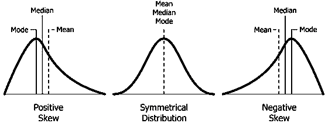

```{r, include=FALSE}
knitr::opts_knit$set(root.dir = "D:/Epi Biostat with R/Biostat_with_R/")
```

```{r, include=FALSE, warning=FALSE,message=FALSE, echo=FALSE}
#load libraries and datasets
library(tidyverse)
library(car)        # leveneTest(), Anova() (Type II/III SS)
library(DescTools)  # CI helpers used later in the chapter

data <- readxl::read_excel("Section2/Categorical data analysis/Datasets/wcgs.xls")
```

## **Which test statistic should we use?**

The choice of a test statistic depends on the following:

1.  [Hypothesis that you are testing](#sec-hypothesis_testing)

2.  [Measurement scale of dependent and independent variables](#sec-data_types)

3.  [Normality of distribution of numeric variable](#sec-normality_testing)

4.  Degree of freedom (df)

5.  Independent data or paired data

Following flowchart shows list of all test that can be used based on the conditions mentioned above.


## Different test statistics

**Correlation:** This test statistic is used to determine the association between two numerical dependent and independent variables. There are two correlation coefficients calculated for two different conditions.

1.  **Pearson's correlation:** This test statistic is used if both dependent and independent variables are normally distributed.

2.  **Spearman correlation:** This test statistic is used if dependent or independent variables are non-normally distributed.

**One sample Z-test:** This test is used to compare th the mean from the sample with the hyppthesized value.

**T-test or Z-test:** These test statistics are used to compare normally distributed means across two categories. The T-test is used if the population variance is unknown or the sample size is small. Otherwise, the Z test can be used.

**Paired T-test:** These test statistic is used to compare normally distributed means between pairs.

**Mann-Whitney U Test :** It is non-parametric alternative of T-test.

**Wilcoxon Rank-Sum Test:** It is non-parametric alternative of paired T-test.

**ANOVA (Analysis of Variance):** Used when comparing means across more than two groups. One-way ANOVA is used for one independent variable, while two-way ANOVA involves two independent variables.

**Kruskal-Wallis Test:** This is a non-parametric alternative to ANOVA, used when comparing non-normally distributed mean between three or more independent categories.

**Repeated measure ANOVA:** This is used if the normally distributed numeric variables are compared between three or more measurements (repeated measure data).

**Fried Mann test:** This is used if the non-normally distributed numeric variables are compared between three or more repeated measurements.

**Chi-square test:** This test statistic is used to determine the association between categorical dependent and categorical independent variables. Multiple chi-square tests are used if the degree of freedom is 1, 2, or more.

-   **Pearson Chi-Square test:** It is used if the degree of freedom is 1 or more, variables are independent (not paired), and the expected cell count is \>5.

-   **Chi-square test with Yates correction:** It is used if the degree of freedom is 1, variables are independent (not paired), and the total sample size is \<50.

-   **Fischer's exact test:** It is used if the degree of freedom is 1, variables are independent (not paired), and the expected cell count is \<5.

-   **McNemar test:** It is used if the degree of freedom is 1, and variables are paired (not independent).

::: callout-note
Always ensure that the assumptions of the chosen test are met for your data. If you are unsure about which test statistic to use, consulting with a statistician or using statistical software that guides you based on your data and research question is a good practice.
:::

## Checking Normality assumptions

Different tests involving numeric data needs normality assumptions check. Lets dive deep into the skewness, kurtosis and normality.

### Skewness, Kurtosis and Normality

#### Skewness and Kurtosis

-   **Skewness:** Skewness measures the asymmetry of a distribution. It indicates whether the data is skewed to the left (negatively skewed) or to the right (positively skewed). A skewness value close to 0 suggest a roughly symmetric distribution. Negative skewness indicates a tail to the left while positive skewness indicates a tail to the right
-   **Kurtosis:** Kurtosis measures the "tailedness" of a distribution. It reflects how much data is in the tails and how sharp or flat the peak is. A kurtosis value around 0 is associated to normal distribution. Positive kurtosis indicates heavier tails while negative kurtosis indicates lighter tails.

We can calculate skewness and kurtosis using **moments** package. Lets calculate skewness and kurtosis in our dataset.

Function used: `skewness ()` and `kurtosis()`

```{r}
# install.packages("moments")
library(moments)

# skewness
skewness(data$age) # Interpretation: slight right ward skew

kurtosis(data$age) # Interpretation: it is higher than 3 (this indicates heavier tails)
```

#### Testing normality of numeric variables {#sec-normality_testing}

Normality is an important assumption in many statistical tests, such as **t-tests, ANOVA, linear regression, and parametric tests**. Ensuring that data is normally distributed helps validate the results of these tests and ensures the reliability of statistical inferences. In the figure below, only middle one is normally distributed whereas other two are not.



Normality testing can be conducted using several methods:

1.  Statistical test
    1.  Shapiro-Wilk test
    2.  Kolmogorov-Smirnov (KS) test
2.  Graphical
    1.  Q-Q plot
    2.  Histogram

##### Shapiro-Wilk Test

The Shapiro-Wilk test is a widely used statistical test for normality. It evaluates the null hypothesis that a sample comes from a normally distributed population. It is particularly effective for small to moderate sample sizes (typically \< 50).

**Shapiro-Wilk test** (`shapiro.test()`) tests $H_0:$ the data are drawn from a normal distribution, vs. $H_1:$ they are not drawn from normal distribution. The test statistic, W, compares the observed data to what would be expected under normality. A p-value \< 0.05 often leads to rejecting the null hypothesis, indicating non-normality.

```{r}
dt <- rnorm(1000)

# Shapiro wilk test (works for sample <5000)
shapiro.test(dt)

shapiro.test(data$height)   # roughly symmetric, bell-shaped variable
shapiro.test(data$ncigs)    # heavily right-skewed (many non-smokers -> many zeros)
```

::: callout-caution
Shapiro-Wilk (like most goodness-of-fit tests) becomes extremely sensitive with large samples in a cohort of `r nrow(data)` like `wcgs`, even trivial, practically unimportant deviations from normality will produce a significant (p \< 0.05) result. For large $n$, weigh the Q-Q plot and histogram more heavily than the p-value alone, and rely on the Central Limit Theorem (sample means are approximately normal for large $n$ even when the raw data are not) when deciding whether a t-test/ANOVA is still reasonable.
:::

**Interpretation:** The test statistic (W) is 0.99786, and the p-value is 0.7844. With a high p-value, there is no significant evidence to reject the null hypothesis, suggesting that the data is reasonably consistent with a normal distribution.

##### Kolmogorov-Smirnov (KS) test

The Kolmogorov-Smirnov test is a non-parametric test used to compare a sample distribution to a reference distribution (e.g., normal distribution). It measures the maximum distance between the empirical distribution function of the sample and the cumulative distribution function of the reference distribution. While it can be used for normality testing, it is less powerful than the Shapiro-Wilk test for this purpose, especially for small samples.

```{r}
# KS test
ks.test(dt,"pnorm", exact = T)
```

**Interpretation:** The test statistic (D) is 0.017067, and the p-value is 0.9982. With a high p-value, there is no significant evidence to reject the null hypothesis, indicating that the data does not significantly differ from the assumed distribution in a two-sided test.

##### Q-Q plot

A Q-Q plot is a graphical tool to assess whether a dataset follows a particular distribution, such as the normal distribution. It plots the quantiles of the sample data against the quantiles of the theoretical distribution. If the points fall approximately along a straight line, the data is likely normally distributed. Deviations from the line (e.g., curves or outliers) suggest departures from normality.

```{r}
# QQ plot
qqnorm(data$age)
```

**Interpretation:** In the first chart, the points do not deviate significantly from the line, indicating that the data, `dt`, is normally distributed. However, in the second chart, the points deviate from the line, forming an S-shaped curve, which suggests that the data is not normally distributed.

##### Histogram

A histogram is a visual representation of the distribution of a dataset. It divides the data into bins and displays the frequency of observations in each bin.For normality testing, the shape of the histogram is compared to the bell-shaped curve of a normal distribution. Symmetry, peak at the mean, and tapering tails are indicators of normality. While useful for a quick visual check, histograms can be subjective and less reliable for small sample sizes.

```{r}
# Histogram
sequence <- seq(min(data$age), max(data$age), 1)
fun <- dnorm(sequence, mean = mean(data$age), sd = sd(data$age))
hist(data$age,
     main = "data",
     ylab = "Frequency",
     xlab="dt",
     col="skyblue", probability = T)
lines(sequence, fun, col="blue", lwd=2)
```

**Interpretation:** Since, the chart seems to be asymmetric which indicates that the data is not normally distributed.

## Checking Equal Variance (Homogeneity of Variance) assumption

Two-sample and multi-group tests often additionally assume the groups being compared have similar variances. Three common formal tests:

-   **F-test for two variances** (`var.test()`): compares the variances of exactly two groups; assumes each group is itself normally distributed.
-   **Bartlett's test** (`bartlett.test()`): generalizes the F-test to two or more groups; also assumes normality within each group.
-   **Levene's test** (`car::leveneTest()`): tests the same hypothesis as Bartlett's test but is **robust to non-normality**, making it the preferred default in practice.

```{r}
var.test(chol ~ chd69, data = data)                    # two groups only
bartlett.test(chol ~ agec, data = data)                 # >= 2 groups, assumes normal within each
car::leveneTest(chol ~ factor(agec), data = data)        # >= 2 groups, robust to non-normality
```

For all three, $H_0:$ the group variances are equal, vs. $H_1:$ they are not. A significant result (p \< 0.05) means the equal-variance assumption is violated, and a variance-robust version of the downstream test (Welch's t-test, Welch's ANOVA — both covered below) should be used instead of the classic (equal-variance) version.

## Decision Summary

+-----------------------------------------------------------------+-----------------------------------------------------------------------------------------------+-----------------------------------------------------------------+
| Question                                                        | Parametric test / assumptions satisfied                                                       | Nonparametric or alternative test / assumptions violated        |
+=================================================================+===============================================================================================+=================================================================+
| Association between two numeric variables                       | [Pearson correlation coefficient](#sec-ppmc)                                                  | [Spearman rank correlation coefficient](#sec-spearman)          |
+-----------------------------------------------------------------+-----------------------------------------------------------------------------------------------+-----------------------------------------------------------------+
| Compare 1 sample mean to a fixed value                          | [One-sample *t*-test](#sec-t_z_test) *(or one-sample z-test if population* $\sigma$ is known) | [Wilcoxon signed-rank test](#sec-wilcoxon)                      |
+-----------------------------------------------------------------+-----------------------------------------------------------------------------------------------+-----------------------------------------------------------------+
| Compare 2 independent group means                               | [Student's *t*-test](#sec-ind_t_test) *(equal variances)*                                     | [Mann–Whitney U test](#sec-manwhitney_u)                        |
|                                                                 |                                                                                               |                                                                 |
|                                                                 | [Welch's *t*-test](#sec-welch_t) *(unequal variances)*                                        |                                                                 |
+-----------------------------------------------------------------+-----------------------------------------------------------------------------------------------+-----------------------------------------------------------------+
| Compare paired or matched measurements                          | [Paired *t*-test](#sec-paired_t)                                                              | [Wilcoxon signed-rank test](#sec-new_testw)                     |
+-----------------------------------------------------------------+-----------------------------------------------------------------------------------------------+-----------------------------------------------------------------+
| Compare 3 or more independent group means                       | [One-way ANOVA](#sec-oneway_anova) *(equal variances)*                                        | [Kruskal–Wallis test](#sec-h_test_KW)                           |
|                                                                 |                                                                                               |                                                                 |
|                                                                 | [Welch's ANOVA](#sec-welch_oneway_anova) *(unequal variances)*                                |                                                                 |
+-----------------------------------------------------------------+-----------------------------------------------------------------------------------------------+-----------------------------------------------------------------+
| Compare 3 or more repeated or matched measurements              | Repeated-measures ANOVA                                                                       | Friedman test                                                   |
+-----------------------------------------------------------------+-----------------------------------------------------------------------------------------------+-----------------------------------------------------------------+
| Association between two independent categorical variables       |                                                                                               | [Chi-square test](#sec-chisq)                                   |
|                                                                 |                                                                                               |                                                                 |
|                                                                 |                                                                                               | @sec-fisher_exact *(especially for small expected cell counts)* |
+-----------------------------------------------------------------+-----------------------------------------------------------------------------------------------+-----------------------------------------------------------------+
| Association between two dependent/matched categorical variables |                                                                                               | [McNemar Chi-square test](#sec-Mcnemar)                         |
+-----------------------------------------------------------------+-----------------------------------------------------------------------------------------------+-----------------------------------------------------------------+
