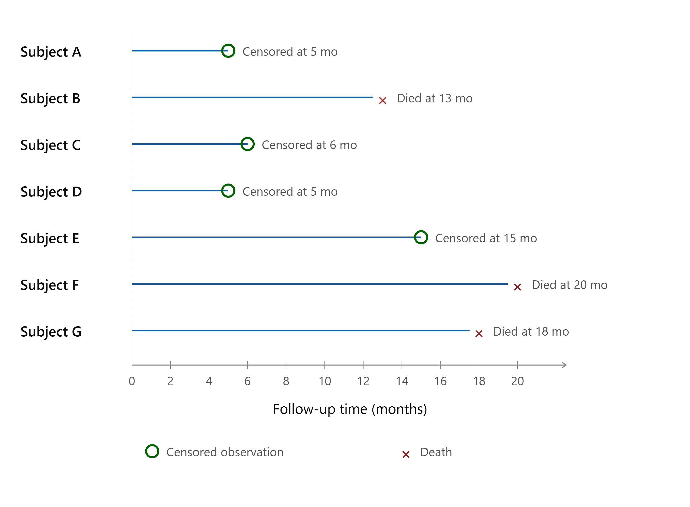

## Introduction

Sometime outcome variable may consist of time-to-event consisting of two components- **Time and event**. **Time** means years, months, weeks or days from the beginning of the follow-up of an individual until an events occurs. Time can be the age of individual when an event occurs. It is non negative values. **Event** means occurrence of death, disease, incidence, recovery or remission or any experience of interest that can happen to individual. They are binary. Analytic alternatives such as `T-test`, `ANOVA` , `linear models` comparing survival time doesn't incorporate event component. Logistic regression or other binomial analysis of event (yes/no) doesn't incorporate time component. In order to incorporate both component at the same time, there is different analytical approach which is **Survival Analysis**. The different examples of survival analysis problems are:

-   Leukemia patients/time in remission (weeks)

-   Heart transplants/time until death (months)

-   Disease-free cohort/time until heart disease (years)

## Censoring

Censoring occurs when some information about individual survival time is known, but exact survival time is not known.It can happen: - when study ended before study participants experienced an event - loss to follow up - participants withdraw from the study

We should not discard the censored data and if we do, we are ignoring the partial information available on survival.



### Types

There are three types of censoring

-   **Right Censoring:** It occurs when a true survival time is greater than or equal to the observed survival time.

-   **Left Censoring**: It occurs when a true survival time is less than or equal to the observed survival time.

-   **Interval censoring**: It occurs when a true survival time lies within the know interval but exact time is not known.

### **Assumptions of censoring:**

There are three assumptions of censoring that needed to be considered during survival data analysis.

-   **Independent censoring:** Within any subgroup of interest, the subjects who are censored at time t should be representative of all the subjects in that subgroup who remained at risk at time t with respect to their survival experience. In other words, censoring is independent if it is random within any subgroup of interest.

-   **Random censoring:** Subjects who are censored at time t should be representative of all the study subjects who remained at risk at time t with respect to their survival experience

-   **Non-informative censoring:** It occurs if the distribution of survival times provides no information about the distribution of censorship times, and vice versa. Otherwise, the censoring is informative. If more than 40% patients in the treatment arm dropped from the study, then censoring is informative about the side effects of the treatment.

## Data structure for survival data analysis

```{r, warning=FALSE}
# install.packages("survival")
library(survival)

# cancer data 
data("cancer")

head(lung)
```

## Mathematical functions for survival analysis

There are two mathematical functions for survival analysis:

-   Survivorship Function, `S(t)`

-   Hazard Function, `h(t)`


### **Survivor function**

The survivor function `S(t)` gives the probability that a person survives longer than some specified time `t`. That is, `S(t)` gives the probability that the random variable `T` exceeds the specified time `t`. The characteristics of survivor function are:

-   non-increasing

-   At time `t = 0, S(t) = S(0) = 1`(probability of surviving past time 0 is 1)

-   At time `t = infinity, S(t) = S(infinity) = 0`

-   When using actual data graphs are typically step functions. Because the study period is never infinite, it is possible that not everyone studied experiences the event. The estimated survivor function may not go all the way to zero at the end of the study.

### **Hazard function**

Hazard function `h(t)` measures the instantaneous potential per unit time for the event to occur, given that the individual has survived up to time t. While the survivor function focuses on not failing, the hazard function focuses on failing, that is, on the event occurring. In some sense, the hazard function can be considered as giving the opposite side of the information given by the survivor function. Some characteristics of hazard function are

-   It is always non-negative

-   It has no upper bound

-   Exponential model, Weibull, and log-normal are some mathematical forms of hazard functions.

### **Cummulative hazard**, `H(t)`:

It describes the accumulated risk up to time `t`.

$$
H(t) = \int_{0}^{t} h(u) d(u)
$$

The expression of survival function in terms of hazard functions:

$$
S(t) =\exp \left [-\int_{0}^{t} h(u) du\right]
$$

The expression of hazard function in terms of survivor function:

$$
h(t) = - \left[ \frac{dS(t) /dt}{S(t)} \right]
$$

## Kaplan-Meier Method

The survivor function, S(t) gives the probability that an individual survives longer than a specified time t. In practice, real data are subject to finite sample size and random variation, so the true survivor function must be estimated from observed data. One approach is to fit a parametric model, which imposes a predefined mathematical form on the data to produce a smooth curve. This offers precision but relies on strong distributional assumptions that may not hold in real practice. A non-parametric alternative is the Kaplan-Meier method, which requires fewer assumptions and allows for a more flexible curve shape. Rather than forcing the data into a fixed structure, the **Kaplan-Meier estimator** let the data "speak for itself."

### The Product-Limit Estimator

The Kaplan-Meier (KM) estimator is also called the **product-limit estimator**, because it is calculated by multiplying together a series of conditional survival probabilities. Suppose there are $k$ distinct observed event times in a sample, ordered as $t_{(1)} < t_{(2)} < \dots < t_{(k)}$. At each event time $t_{(j)}$:

-   $n_j$ = the number of individuals **at risk** just before $t_{(j)}$ (i.e., still under observation and event-free)
-   $d_j$ = the number of individuals who **have the event** at $t_{(j)}$

The KM estimator of the survivor function is:

$$
\hat{S}(t) = \prod_{j:\, t_{(j)} \le t} \left(1 - \frac{d_j}{n_j}\right)
$$

In words: the estimated probability of surviving past time $t$ is the product, over every event time up to and including $t$, of the conditional probability of surviving that event time given survival up to it. Individuals who are censored are not counted as events, but they are removed from the risk set at the time they are censored. This is precisely how the KM method incorporates the partial information contributed by censored subjects instead of discarding it.

**Worked example:** Let us consider a small 7-subject data set which is as below:

+---------+------+-----------------------------+
| Subject | Time | **Status**                  |
|         |      |                             |
|         |      | ***1: Death/ 0: Censored*** |
+=========+======+=============================+
| A       | 5    | 0                           |
+---------+------+-----------------------------+
| B       | 13   | 1                           |
+---------+------+-----------------------------+
| C       | 6    | 0                           |
+---------+------+-----------------------------+
| D       | 5    | 0                           |
+---------+------+-----------------------------+
| E       | 15   | 0                           |
+---------+------+-----------------------------+
| F       | 20   | 1                           |
+---------+------+-----------------------------+
| G       | 18   | 1                           |
+---------+------+-----------------------------+

**Step-1:** Order the data by time

| Subject | Time (in month) | **Status,** *1: Death/ 0: Censored* |
|---------|-----------------|-------------------------------------|
| A       | 5               | 0                                   |
| D       | 5               | 0                                   |
| C       | 6               | 0                                   |
| B       | 13              | 1                                   |
| E       | 15              | 0                                   |
| G       | 18              | 1                                   |
| F       | 20              | 1                                   |

**Step-2:** Determine the number of subject at risk in the given time, number of events at that time. Calculate the probability of event in the risk set by using $d_j/n_j$ in column 4. There after, calculate survival probability by substracting the probability of event from 1 like in column 5. At the end, estimate total survival probability by multiplying survival probabilities from column 5.

+----------------+---------------+--------------+-----------+--------------------------------+-----------------------+
| Time $t_{(j)}$ | At risk $n_j$ | Events $d_j$ | $d_j/n_j$ | survival proportion$1-d_j/n_j$ | cummulative survival, |
|                |               |              |           |                                |                       |
|                |               |              |           |                                | $\hat{S}(t)$          |
+:==============:+:=============:+:============:+:=========:+:==============================:+:=====================:+
| 0              | 5             | 0            | 0         | 1.000                          | 1.000                 |
+----------------+---------------+--------------+-----------+--------------------------------+-----------------------+
| 13             | 4             | 1            | 0.25      | 0.75                           | 0.75                  |
+----------------+---------------+--------------+-----------+--------------------------------+-----------------------+
| 18             | 2             | 1            | 0.50      | 0.50                           | 0.375                 |
+----------------+---------------+--------------+-----------+--------------------------------+-----------------------+
| 20             | 1             | 1            | 1         | 0                              | 0                     |
+----------------+---------------+--------------+-----------+--------------------------------+-----------------------+

Censored observations (A and D at month 5, C at 6 months, and E at 15 months) reduce the risk set but do not themselves produce a drop in the survival curve. The curve only steps down at observed event times.

```{r, warning=FALSE}
library(survival)

df_km <- data.frame(
  subject = c("A", "B", "C", "D", "E", "F", "G"),
  time    = c(5,5, 6, 13, 15, 18,20),
  status  = c(0, 0, 0,1, 0, 1,1)   # 1 = event (death), 0 = censored
)

fit_km <- survfit(Surv(time, status) ~ 1, data = df_km)
summary(fit_km)

plot(fit_km, xlab = "Follow-up time (months)", ylab = "Survival probability",
     main = "Kaplan-Meier Curve", conf.int = FALSE, mark.time = TRUE)
```

### Standard Error and Confidence Interval for S(t)

Because $\hat{S}(t)$ is estimated from a finite, censored sample, it has sampling variability that should be reported alongside the point estimate. The most widely used variance estimator is **Greenwood's formula** [@greenwood1926], derived using a Taylor series (delta method) approximation:

$$
\widehat{Var}\left[\hat{S}(t)\right] = \left[\hat{S}(t)\right]^2 \sum_{t_{(j)} \le t} \frac{d_j}{n_j(n_j - d_j)}
$$

A large-sample confidence interval for $S(t)$ follows directly:

$$
\hat{S}(t) \pm z_{1-\alpha/2} \sqrt{\widehat{Var}\left[\hat{S}(t)\right]}
$$

In practice, software typically applies a log or complementary log-log transformation before constructing the interval and then back-transforms, which keeps the bounds within $[0,1]$. In R, `survfit()` computes Greenwood's standard errors and confidence limits automatically:

```{r, warning=FALSE}
fit_km_ci <- survfit(Surv(time, status) ~ 1, data = df_km, conf.type = "log-log")
summary(fit_km_ci)

plot(fit_km_ci, xlab = "Follow-up time (months)", ylab = "Survival probability",
     main = "Kaplan-Meier Curve with 95% CI", conf.int = TRUE, mark.time = TRUE, col = "steelblue")
```

## Comparing Survival Between Two or More Groups: The Log-Rank Test

A common goal in survival analysis is to compare the survival experience of two or more groups defined by an exposure, treatment, or other categorical factor. This is done by computing a separate KM curve for each group and then testing formally whether the underlying survivor functions differ.

**Hypotheses:**

-   $H_0$: The survivor functions are identical across groups
-   $H_A$: The survivor functions differ across groups

At each distinct event time across the combined data, we can construct a table of observed events and, under $H_0$, the number of events **expected** in each group (proportional to that group's share of the risk set at that time). Summing observed minus expected events for a group across all event times, and appropriately weighting by the variance, yields the **log-rank test statistic**:

$$
\chi^2 = \frac{\left(\sum_j (O_{1j} - E_{1j})\right)^2}{\sum_j Var(O_{1j} - E_{1j})} \sim \chi^2_{(g-1)}
$$

where $g$ is the number of groups being compared. Under $H_0$, this statistic follows a chi-square distribution with $g - 1$ degrees of freedom (df).

**Worked example.** In a classical clinical trial, leukemia patients were randomized to a 6-MP treatment arm versus placebo. In this study, researcher wanted to answer whether there is difference in survival between patients with maintenance of chemotherapy versus no maintenance of chemotherapy. The dataset is as follows:

```{r}
data(cancer, package = "survival")
data(aml)
head(aml)
```

In order to answer the question, we have to perform log rank test. The 5 step hypothesis test is as follows:

**Step 1: Set up Hypothesis**

*Ho: Two survival functions of chemotherapy Maintained and Not maintained are identical.*

*Ha: Two survival functions of of Maintained and Not maintained differ*

**Step 2: Level of significance**

$$\alpha=0.05$$

**Step 3: Selection of test statistics**

Since, two survival curve between chemotherapy Maintained and Not maintained are to be compared, log rank test is the appropriate test to perform. The formula for log rank test statistics is

$$
\chi^2 = \frac{\left(\sum_j (O_{1j} - E_{1j})\right)^2}{\sum_j Var(O_{1j} - E_{1j})} \sim \chi^2_{(df=1)}
$$

**Step 4: Calculation of test statistics**

R was used to perform analysis. `survdiff()` in R performs the log-rank test directly and reports the chi-square statistic, degrees of freedom, and p-value. The output of the analysis is as follows:

```{r warning=FALSE}

fit_aml <- survfit(Surv(time, status) ~ x, data = aml)
fit_aml

survdiff(Surv(time, status) ~ x, data = aml)

plot(fit_aml, col = c("blue", "red"), lty = 1:2,
     xlab = "Weeks", ylab = "Survival probability",
     main = "Kaplan-Meier by Maintenance Therapy (aml data)")
legend("topright", legend = levels(aml$x), col = c("blue", "red"), lty = 1:2)
```

**Manual calculation**

**Step 1:** Arrange the data in as in the table below. First get all the time points in assending order. Then, for each time point get the number of events (m), number of censored observation and number of subjects at risk (n).

| Time |   | **Maintained** |   |   | **Not maintained** |   |
|----|----|----|----|----|----|----|
|  | **Censored (k1)** | **Events (m1)** | **At Risk (n1)** | **Censored (k2)** | **Events (m2)** | **At Risk (n2)** |
| 5 |  |  | 11 |  | 2 | 12 |
| 8 |  |  | 11 |  | 2 | 10 |
| 9 |  | 1 | 11 |  |  | 8 |
| 12 |  |  | 10 |  | 1 | 8 |
| 13 | 1 | 1 | 10 |  |  | 7 |
| 16 |  |  | 8 | 1 |  | 7 |
| 18 |  | 1 | 8 |  |  | 6 |
| 23 |  | 1 | 7 |  | 1 | 6 |
| 27 |  |  | 6 |  | 1 | 5 |
| 28 | 1 |  | 6 |  |  | 4 |
| 30 |  |  | 5 |  | 1 | 4 |
| 31 |  | 1 | 5 |  |  | 3 |
| 33 |  |  | 4 |  | 1 | 3 |
| 34 |  | 1 | 4 |  |  | 2 |
| 43 |  |  | 3 |  | 1 | 2 |
| 45 | 1 |  | 3 |  | 1 | 1 |
| 48 |  | 1 | 2 |  |  | 0 |
| 161 | 1 |  | 1 |  |  | 0 |

Step-2: Estimate expected number of events for each group using the formula below$E_1=\frac{n_1}{(n _1+n_2)}(m_1+m_2)$

$E_2=\frac{n_2}{(n_1+n_2)}(m_1+m_2)$ .

$Variance=\sum Var=\sum\frac{n_1*n_2 (m_1+m_2)(n_1+n_2-m_1-m_2)}{(n_1+n_2)^2 (n_1+n_2-1)}$

|      Time |   E₁ |   E₂ | n₁n₂ | n1+n2 | m1+m2 |      Var |     O₁−E₁ |    O₂−E₂ |
|----------:|-----:|-----:|-----:|------:|------:|---------:|----------:|---------:|
|         5 | 0.96 | 1.04 |  132 |    23 |     2 |     0.48 |     -0.96 |     0.96 |
|         8 | 1.05 | 0.95 |  110 |    21 |     2 |     0.47 |     -1.05 |     1.05 |
|         9 | 0.58 | 0.42 |   88 |    19 |     1 |     0.24 |      0.42 |    -0.42 |
|        12 | 0.56 | 0.44 |   80 |    18 |     1 |     0.25 |     -0.56 |     0.56 |
|        13 | 0.59 | 0.41 |   70 |    17 |     1 |     0.24 |      0.41 |    -0.41 |
|        16 | 0.00 | 0.00 |   56 |    15 |     0 |     0.00 |      0.00 |     0.00 |
|        18 | 0.57 | 0.43 |   48 |    14 |     1 |     0.24 |      0.43 |    -0.43 |
|        23 | 1.08 | 0.92 |   42 |    13 |     2 |     0.46 |     -0.08 |     0.08 |
|        27 | 0.55 | 0.45 |   30 |    11 |     1 |     0.25 |     -0.55 |     0.55 |
|        28 | 0.00 | 0.00 |   24 |    10 |     0 |     0.00 |      0.00 |     0.00 |
|        30 | 0.56 | 0.44 |   20 |     9 |     1 |     0.25 |     -0.56 |     0.56 |
|        31 | 0.63 | 0.38 |   15 |     8 |     1 |     0.23 |      0.38 |    -0.38 |
|        33 | 0.57 | 0.43 |   12 |     7 |     1 |     0.24 |     -0.57 |     0.57 |
|        34 | 0.67 | 0.33 |    8 |     6 |     1 |     0.22 |      0.33 |    -0.33 |
|        43 | 0.60 | 0.40 |    6 |     5 |     1 |     0.24 |     -0.60 |     0.60 |
|        45 | 0.75 | 0.25 |    3 |     4 |     1 |     0.19 |     -0.75 |     0.75 |
|        48 | 1.00 | 0.00 |    0 |     2 |     1 |     0.00 |      0.00 |     0.00 |
|       161 | 0.00 | 0.00 |    0 |     1 |     0 |          |      0.00 |     0.00 |
| **Total** |      |      |      |       |       | **4.01** | **−3.69** | **3.69** |

Log rank test value is calculated using the formula

$$
Log  rank= \frac{(O-E)^2}{Var} = 3.69^2/4.01 =3.4
$$

**Step 5: Decision and conclusion**

Since p-value is 0.07 which is greater than 0.05 and log rank statistics is 3.4 which is less than critical value of 3.84, we failed to reject the null hypothesis. Thus we conclude that there is no significant difference in two survival curve for chemotherapy Maintained and Not maintained groups.

## Median Survival Time

According to National Cancer Institute, **median survival time** is the length of time from diagnosis (or start of treatment) at which half of the patients in a group are still alive[@definiti2011]. It is directly read from the KM curve as the time at which $\hat{S}(t) = 0.50$ is first crossed or first achieved. Because it does not require assuming the entire tail of the distribution is observed, median survival is often more useful and more robust to report than mean survival time in the presence of censoring.

```{r}
# Plot
plot(fit_aml,
     col = c("blue", "red"),
     lty = 1:2,
     lwd = 2,
     xlab = "Weeks",
     ylab = "Survival probability",
     main = "Kaplan-Meier by Maintenance Therapy")

legend("topright",
       legend = levels(aml$x),
       col = c("blue", "red"),
       lty = 1:2,
       lwd = 2,
       bty = "n")

# Horizontal line at 50% survival
abline(h = 0.5, lty = 3, col = "darkgray")

# Median survival times
med <- summary(fit_aml)$table[, "median"]

# Add vertical lines
abline(v = med[1], col = "blue", lty = 3)
abline(v = med[2], col = "red", lty = 3)

# Label median survival times
text(med[1]+0.5, 0.05,
     labels = paste0("Median = ", med[1]),
     col = "blue",
     pos = 4,)

text(med[2]-30, 0.05,
     labels = paste0("Median = ", med[2]),
     col = "red",
     pos = 4)
```

If $\hat{S}(t)$ never falls to 0.50 during the observation period due to early end of follow up, or treatment is highly effective, median survival is **not estimable** and is typically reported as **"not reached"**. A 95% confidence interval for median survival can also be obtained from the KM curve.

```{r, warning=FALSE}
fit_aml   # printing a survfit object reports median survival and its 95% CI directly
```

The quartiles of survival time divide the estimated survival experience into four equal parts based on the Kaplan–Meier survival function. They are defined as the times at which the estimated survival probability first reaches specific levels.

-   **First quartile (Q1):** The time at which the estimated survival probability first falls to **0.75**. At this point, approximately 25% of participants have experienced the event.

-   **Median survival time (Q2):** The time at which the estimated survival probability first falls to **0.50**. By this time, approximately 50% of participants have experienced the event.

-   **Third quartile (Q3):** The time at which the estimated survival probability first falls to **0.25**. By this time, approximately 75% of participants have experienced the event.

```{r}
quantile(fit_aml)

```

**Interpretation**: The KM estimate indicates that 25% of patients experienced the event by 18 weeks(95%CI: 13, NA) in maintained group, and by 8 weeks (95% CI: 5 to 30) in not maintained group. Similarly, it indicates that 50% of patients experienced the event by 31 weeks(95%CI: 18, NA) in maintained group, and by 23 weeks (95% CI: 8 to NA) in not maintained group. Similarly, it indicates that 75% of patients experienced the event by 48 weeks(95%CI: 34, NA) in maintained group, and by 33 weeks (95% CI: 27 to NA) in not maintained group.

## The Cox Proportional Hazards Model

### Limitations of the Kaplan-Meier Approach

The KM method and log-rank test are extremely useful, but they have important limitations:

-   They require **categorical** predictors (grouping variables)
-   They do not **control for covariates** (confounding cannot be adjusted for)
-   They cannot accommodate **time-dependent** variables

Ordinary linear regression is not a solution either, because it requires a continuous, uncensored outcome ranging over $(-\infty, \infty)$, not appropriate for time-to-event data with censoring.

### Sir David Cox and the Proportional Hazards Model

In 1972, the English statistician Sir David Cox introduced the proportional hazards assumption and, with it, a regression model for survival data that focuses on the **hazard function** rather than on survival time directly [@cox1972]. The Cox model is among the most heavily cited papers in all of statistics, and the **Cox Proportional Hazards (PH) model** remains the most widely used regression approach for time-to-event data in the health sciences.

The model is built by allowing the hazard for an individual to depend on a baseline hazard function multiplied by an exponentiated linear combination of covariates:

$$
h(t, \mathbf{X}) = h_0(t) \exp\left(\beta_1 X_1 + \beta_2 X_2 + \dots + \beta_p X_p\right)
$$

Two features of this formula are essential:

-   $h_0(t)$, the **baseline hazard function**, depends on $t$ but not on the $X$'s. It represents the hazard for an individual with all covariates equal to zero, and its functional form is left **completely unspecified**.
-   The exponential term $\exp(\sum \beta_i X_i)$ depends on the $X$'s but **not on** $t$ . These are called time-independent covariates, and their effect on the hazard is assumed constant over time.

Because $h_0(t)$ is not specified, the Cox model is called **semi-parametric**: some structure is assumed for how covariates act on the hazard, but no particular distributional form is imposed on survival time itself. This is in contrast to a fully **parametric** model, whose functional form is completely specified except for the values of unknown parameters (discussed later in this chapter). Despite leaving $h_0(t)$ unspecified, the Cox model is remarkably robust regression coefficients, hazard ratios, and adjusted survival curves obtained from it closely approximate results from the correctly specified parametric model in a wide range of situations.

### Assumptions of the Proportional Hazards Model

1.  **Independent observations** across subjects
2.  **Independent censoring**
3.  **Proportional hazards**: The hazard for one individual is proportional to the hazard for any other individual, and this proportionality constant does not change over time

### Fitting the Model: Maximum Likelihood

The regression coefficients $\beta_1, \dots, \beta_p$ are estimated using **maximum likelihood**, maximizing a *partial* likelihood function that depends only on the ordering of event times and the composition of the risk sets, not on the unspecified baseline hazard. This is analogous to how logistic regression coefficients are estimated. Because the baseline hazard cancels out of this partial likelihood, valid inference on the $\beta$'s is possible without ever estimating $h_0(t)$.

### The Hazard Ratio

Suppose we want to compare the hazard for two individuals (or groups) with covariate vectors $\mathbf{X}^*$ and $\mathbf{X}$. Taking the ratio of their hazards, the baseline hazard $h_0(t)$ cancels out entirely:

$$
\frac{h(t, \mathbf{X}^*)}{h(t, \mathbf{X})} = \frac{h_0(t)\exp(\sum \beta_i X_i^*)}{h_0(t)\exp(\sum \beta_i X_i)} = \exp\left[\sum_i \beta_i (X_i^* - X_i)\right]
$$

This ratio, the **hazard ratio (HR)**, is the primary measure of association reported from a Cox model. For a single binary covariate coded 0/1, comparing $X_1^*=1$ to $X_1=0$ gives simply $HR = \exp(\beta_1)$. For a continuous covariate, $HR = \exp(\beta_1)$ represents the hazard ratio associated with a **one-unit increase** in that covariate, holding all other covariates constant.

**Interpreting** $\beta$:

-   $\beta_1$ is the increase in the *log* hazard per one-unit increase in $X_1$
-   $\exp(\beta_1)$ is the hazard ratio per one-unit increase in $X_1$
-   $\beta_1 > 0$ (equivalently $HR>1$): increasing $X_1$ is associated with **increased** hazard (worse survival)
-   $\beta_1 < 0$ (equivalently $HR<1$): increasing $X_1$ is associated with **decreased** hazard (better survival)

**Worked example (single binary predictor).** For lung cancer data(228 patients), fitting $h(t)/h_0(t) = \exp(\beta_1 X_1)$ with $X_1=1$ for Male produces $\hat\beta_1 = -0.531$, so $\widehat{HR} = \exp(-0.531) = 0.588$ (95% CI: 0.42, 0.82), $\chi^2=10.63$, $p=0.001$. **Interpretation:** the hazard of death for female patients is 41% lower compared to male patients.

**Worked example (multiple covariates).** In a lung cancer data, the hazard of death among female compared to male after adjusting for age and ph-ecog was determined. , fitting $h(t)/h_0(t) = \exp(\beta_1 \text{Sex} + \beta_2 \text{Age}+\beta_3 \text{Ph.ecog})$ yields $\widehat{HR}_{sex} = \exp(-0.55) = 0.58$ (95% CI: 0.41, 0.80) and $\widehat{HR}_{age} = \exp(0.011) = 1.01$ (95% CI: 0.99 to 1.03) and $\widehat{HR}_{Ph.ecog} = \exp(0.46) = 1.59$ (95% CI: 1.27 to 1.99).

**Interpretation:** After adjustment for age and ECOG performance status, females had a significantly lower hazard of death than males (HR = 0.58, 95% CI: 0.41 to 0.80). Each additional year of age was associated with an estimated 1% increase in the hazard of death (HR = 1.01, 95% CI: 0.99 to 1.03), although this association was not statistically significant. In contrast, each one-unit increase in ECOG performance status was associated with a 59% higher hazard of death (HR = 1.59, 95% CI: 1.27 to 1.99), indicating that worse performance status is an important predictor of mortality after controlling for age and sex.

```{r, warning=FALSE}
data(cancer)
head(lung)

# cleaning
lung$sex <- factor(lung$sex, levels = c(1,2), labels = c("Male", "Female"))
lung$status <- ifelse(lung$status==1, 0, 1)

# Cox model 1
cox1 <- coxph(Surv(time, status) ~ sex, data = lung)
summary(cox1)
# cox model 2
cox2 <- coxph(Surv(time, status) ~ age + sex + ph.ecog, data = lung)
summary(cox2)
```

The `exp(coef)` column in the R output is precisely the estimated hazard ratio for each covariate, with the associated 95% confidence interval given in the `summary()` output, and the Wald test p-value indicating whether that covariate is significantly associated with survival after adjusting for the others in the model.

## Assessing the Proportional Hazards Assumption

Because the Cox model is *named* after the proportional hazards assumption, this assumption deserves careful evaluation rather than being taken for granted. Three general approaches are used to check it.

### Approach 1: Graphical Evaluation

**Log-log survival curves.** A log-log survival curve is obtained by taking the natural log of the KM survival estimate, twice: $-\ln[-\ln \hat{S}(t)]$ (we negate the first log because probabilities are always $\le 1$, making $\ln \hat S(t)$ negative). If the PH assumption holds for a categorical predictor, the log-log curves for its categories should be roughly **parallel**. Non-parallel or crossing curves suggest violation of assumption.

```{r, warning=FALSE}
plot(survfit(Surv(time, status) ~ sex, data = lung), fun = "cloglog",
     xlab = "Time in days (log scale)", ylab = "log(-log(S(t)))",
     col = c("blue", "red"), main = "Log-log Survival Curves by Sex (lung data)")
legend("bottomright", legend = c("Male", "Female"), col = c("blue", "red"), lty = 1)
```

**Observed vs. expected plots** are a related graphical device: fit a Cox model containing the predictor of interest, obtain "expected" survival curves for each category from the fitted model, and overlay them on the "observed" (KM) curves for the same categories. Close agreement supports the PH assumption; substantial, systematic divergence suggests a violation.

Both graphical approaches share a common weakness: judging "parallel enough" or "close enough" is inherently subjective. Kleinbaum and Klein recommend assuming PH is reasonable unless the evidence against it is fairly convincing.

### Approach 2: Goodness-of-Fit (Schoenfeld Residuals)

Schoenfeld (1982) proposed a formal hypothesis test based on residuals which is now called **Schoenfeld residuals**. It is defined for each predictor, for each subject who experiences an event. If the PH assumption holds for a given covariate, its Schoenfeld residuals should show **no systematic relationship with time**. The test correlates the scaled Schoenfeld residuals with (a function of) survival time; under $H_0$ (hazards proportional) this correlation is zero.

-   $H_0$: hazards are proportional
-   $H_1$: hazards are not proportional
-   Test statistic follows a $\chi^2$ distribution with 1 df per covariate

In R, the entire procedure for every covariate in a fitted Cox model plus a global test is implemented directly by `cox.zph()` function.

```{r, warning=FALSE}
zph2 <- cox.zph(cox2)
zph2
plot(zph2)
```

A small p-value for any row flags a possible PH violation for that covariate (or globally). The accompanying plot shows the scaled Schoenfeld residuals against time with a smoothed trend line. A roughly flat, horizontal trend supports PH, while a clearly sloped or curved trend suggests the covariate's effect changes over time.

### Approach 3: Time-Dependent Covariates

A third approach re-fits the Cox model with an added interaction term between the covariate being assessed and a function of time (e.g., $X \times t$, or a step/"Heaviside" function of time). If this interaction term is statistically significant, the PH assumption is violated for that covariate, its effect on the hazard changes over time. This approach doubles as the foundation for the **extended Cox model**, discussed later in this chapter.

## Model Building: Interaction and Confounding

### Assessing Interaction

A statistical **interaction** (effect modification) is present when the effect of one exposure on the outcome differs across levels of a third variable. In the PH model, because we work with hazard ratios (a multiplicative scale), we are primarily concerned with **multiplicative interaction**. No interaction, on this scale, means:

$$
HR_{11} = HR_{10} \times HR_{01}
$$

That is, the combined effect of two factors acting together equals the product of their separate effects. This can be tested by adding a product term to the model:

$$
h(t,\mathbf{X}) = h_0(t)\exp(\beta_1 A + \beta_2 B + \beta_3 A{\times}B), \qquad H_0: \beta_3 = 0
$$

The interaction coefficient can be tested with a Wald test (from the model output directly) or, preferably, with a **likelihood ratio (LR) test** comparing the full (with interaction) and reduced (without interaction) models:

$$
F_0 = LR_{reduced} - LR_{full} \sim \chi^2_{df}
$$

Statisticians generally consider the LR test to have better statistical properties than the Wald test for this purpose, though the two usually agree. When an interaction is statistically significant, hazard ratios should be reported *separately* for meaningful values or categories of the effect-modifying variable (or the modifier can be treated as a stratifying variable, see below), rather than reporting a single "overall" hazard ratio that obscures the effect modification.

### Assessing Confounding

A **confounder** distorts the observed association between an exposure and outcome because of its own associations with both. Three conditions must all hold for a variable to be a confounder: (1) it must be associated with the outcome, (2) it must be associated with the exposure, and (3) it must **not** be an intermediate step on the causal pathway between exposure and outcome.

From the Cox model, we can compare a **crude** hazard ratio (exposure alone) to an **adjusted** hazard ratio (exposure plus the potential confounder):

$$
\text{Magnitude of confounding} = \frac{HR_{crude} - HR_{adjusted}}{HR_{adjusted}} \times 100\%
$$

A common rule of thumb (the **10% rule**) retains a variable in the model as a confounder if adjusting for it changes the exposure hazard ratio by more than 10%. When several potential confounders are being screened, they are typically evaluated one at a time against the fully adjusted model.

It is worth distinguishing the two phenomena clearly: **confounding** is a distortion of the true association caused by an imbalance in another risk factor, the stratum-specific estimates will be similar to each other but different from the crude estimate. **Effect modification**, by contrast, is a real biological/clinical phenomenon in which the stratum-specific estimates genuinely differ from one another; it should be described and reported, not "adjusted away."

### Model-Building Strategy (E-V-W Framework)

When the primary study goal is a valid **exposure–disease (E-D)** association (as opposed to pure outcome prediction), Kleinbaum and Klein recommend a structured strategy rather than automated stepwise procedures:

1.  **Variable specification** designate one exposure of interest ($E$), and classify remaining covariates as potential confounders ($V_1,\dots,V_p$) and/or potential effect modifiers ($W_1,\dots,W_p$), based on subject-matter knowledge, prior literature, and (optionally) causal diagrams
2.  **Check the PH assumption** for each variable
3.  **Assess interaction** ($E \times W$ terms), retaining significant ones
4.  **Assess confounding** among the $V$'s using the 10% rule, in a **hierarchically well-formulated (HWF)** framework. For example: if a higher-order term (like $E{\times}V_1{\times}V_2$) is retained, all its lower-order components ($E$, $V_1$, $V_2$, $E{\times}V_1$, $E{\times}V_2$, $V_1{\times}V_2$) must also remain in the model, so that hypothesis tests do not depend arbitrarily on how variables happen to be coded

When the goal is instead a good **prediction** model rather than a specific E-D estimate, standard iterative procedures (forward selection, backward elimination, stepwise regression) are more appropriate.

### Evaluating Predictive Accuracy: The C-Statistic

The **concordance index (C-statistic)**, also known as Harrell's C, measures how well a fitted survival model discriminates between subjects who fail sooner versus later, based on their predicted risk scores $\hat\eta_i = \sum \hat\beta_k X_{ik}$. For every comparable pair of subjects, the pair is **concordant** if the subject with the higher risk score has the shorter observed survival time. The C-statistic is the proportion of concordant pairs among all pairs that can be evaluated:

-   $C = 0.5$: no better than chance
-   $C = 1.0$: perfect discrimination

```{r}
# Harrels' C index
concordance(cox2)
```

Because heavy censoring can bias the ordinary C-statistic, **Uno's C-statistic** uses inverse probability of censoring weighting (IPCW) and is generally preferred when censoring exceeds roughly 30%. The R-code to calculate Uno's C-statistic is as follows:

```{r}
#install.packages("survAUC")

library(survAUC)

# Cox model
cox1 <- coxph(Surv(time, status) ~ age + sex,
              data = lung)

UnoC(
  Surv(lung$time, lung$status),
  Surv(lung$time, lung$status),
  predict(cox1, type = "lp") # linear predictor
)
```

## The Stratified Cox Model

When one or more categorical covariates clearly violate the PH assumption, but we still want to control for them, the **stratified Cox (SC) model** offers a solution. Suppose $X_1,\dots,X_p$ satisfy the PH assumption and $Z_1,\dots,Z_k$ do not. We form a single stratification variable $Z^*$ from combinations of categories of the $Z$'s, and fit:

$$
h_g(t,\mathbf{X}) = h_{0g}(t)\exp\left(\sum_i \beta_i X_i\right), \qquad g = 1,\dots,\text{(number of strata)}
$$

Each stratum $g$ is allowed its **own, unspecified baseline hazard function** $h_{0g}(t)$, but the regression coefficients for $X_1,\dots,X_p$ are assumed to be the **same across strata** .This is the "no-interaction" assumption underlying the SC model. Its major advantage is that it lets us **control for** a variable that violates PH; its major limitation is that we can **no longer estimate a hazard ratio for the stratification variable itself**.

The no-interaction assumption can (and should) be checked with a likelihood ratio test comparing a model that allows separate coefficients per stratum against the common-coefficient stratified model. If interaction is present, it is generally better to fit separate models within each stratum than to force a single stratified Cox model.

```{r, warning=FALSE}
data(veteran)
head(veteran)

# check PH assumption first
cox_v <- coxph(Surv(time, status) ~ trt + age + factor(celltype), data = veteran)
cox.zph(cox_v)

# stratify on the variable(s) that violate PH (here, illustratively, celltype)
cox_strat <- coxph(Surv(time, status) ~ trt + age + strata(celltype), data = veteran)
summary(cox_strat)
```

In this formulation, `celltype` no longer produces its own hazard ratio, it defines four separate baseline hazards, one per cell type, while `trt` and `age` retain interpretable, celltype-adjusted hazard ratios.

## The Extended Cox Model for Time-Dependent Covariates

### Time-Dependent Variables

A **time-dependent** variable is one whose value for a given subject can change over the course of follow-up, in contrast to a time-independent variable, which is fixed at baseline. Time-dependent variables arise in two ways:

1.  **Inherently time-dependent** variables change by nature such as smoking status, employment status, air pollution exposure, or (the classic example) heart-transplant status for a patient awaiting a transplant. A patient's transplant indicator is 0 until the day of transplant and 1 thereafter, for the remainder of follow-up.
2.  **Defined** time-dependent variables are constructed specifically to test or relax the PH assumption for a time-independent predictor whose *effect*, not its value, appears to change over time.

Time can enter the extended Cox model in three ways: (1) directly, as $X \times t$; (2) as a general function $X \times g(t)$ (e.g., $g(t)=\log t$); or (3) as a **Heaviside function**, a step function that lets a covariate's effect take one value before a pre-specified time $t_0$ and a different value after it:

$$
h(t,\mathbf{X}) = h_0(t)\exp\left(\beta_1 X + \delta \, X\, g(t)\right), \qquad g(t) = \begin{cases} 0 & t < t_0 \\ 1 & t \ge t_0 \end{cases}
$$

Before $t_0$ the effect of $X$ is $\beta_1$; at or after $t_0$ it becomes $\beta_1 + \delta$. Heaviside functions are attractive because they are simple to interpret and model an abrupt, known-timepoint change in effect (e.g., after a protocol amendment); a general (continuous) function of time is more appropriate when the change in effect is gradual.

Because the general hazard-ratio formula now involves the difference in time-dependent covariate values *at time* $t$, **the hazard ratio itself becomes a function of time**. This is precisely why a model with time-dependent covariates no longer satisfies (and doesn't need to satisfy) the ordinary PH assumption. Estimation still proceeds by maximum (partial) likelihood, and Wald/LR tests and confidence intervals are constructed the same way as for the standard Cox model, though the risk sets used to build the partial likelihood are more complex.

### A Worked Example in R: The Stanford Heart Transplant Data

The `heart` data set built into the **survival** package is the classic time-dependent covariate example:- patients awaiting a heart transplant, where `transplant` status changes value partway through a patient's follow-up time. The data are already arranged in *counting-process* `(start, stop, event)` format, which is the standard way R represents time-dependent covariates:

```{r, warning=FALSE}
data(heart)
head(heart)

cox_td <- coxph(Surv(start, stop, event) ~ age + surgery + transplant, data = heart)
summary(cox_td)
```

Each subject contributes one row per time interval during which their covariate values are constant; a subject who receives a transplant partway through follow-up contributes (at least) two rows, one with `transplant = 0` up to the transplant date, and one with `transplant = 1` from the transplant date onward. This `(start, stop)` counting-process layout is the general mechanism R uses to fit both the extended Cox model and the Heaviside-function formulation described above (a Heaviside term is simply an additional column, computed as the covariate multiplied by an indicator for `stop >= t0`, included alongside the time-independent version of the same covariate).

## Parametric Survival Models

### Motivation

The Cox model is semi-parametric which leaves the baseline hazard $h_0(t)$ completely unspecified. A **parametric survival model**, by contrast, assumes survival time follows a specific probability distribution (exponential, Weibull, log-logistic, log-normal, or generalized gamma, among others), fully specified except for a small number of unknown parameters. Once a probability density function $f(t)$ is specified, the corresponding survival function $S(t) = \int_t^\infty f(u)\,du$ and hazard function $h(t) = f(t)/S(t)$ follow directly specifying any one of the three ($f$, $S$, or $h$) determines the other two.

Parametric models produce smooth theoretical survival curves (rather than the step functions typical of KM and Cox-adjusted estimates), and, if the distributional assumption is reasonable, they yield more precise and more easily summarized estimates (e.g., closed-form expressions for median survival). The trade-off is the added distributional assumption itself, which should be checked.

### The Exponential Model

The simplest parametric survival model assumes a **constant hazard** over time, $h(t) = \lambda$, which implies $S(t) = \exp(-\lambda t)$. Re-parameterizing $\lambda = \exp(\beta_0 + \beta_1 X_1 + \dots)$ allows covariates to be incorporated. Note that assuming a constant hazard is a *much stronger* assumption than proportional hazards if the hazards themselves are constant, their ratio is automatically constant, but a constant ratio does not require either hazard individually to be constant.

### The Weibull Model

The **Weibull distribution** is the most widely used parametric survival model. It generalizes the exponential by adding a shape parameter $p$ that governs whether the hazard increases, decreases, or stays constant over time (the exponential is the special case $p=1$). A convenient property of the Weibull model is that **if the AFT assumption holds, the PH assumption also holds** for a Weibull-distributed outcome making it something of a bridge between the two frameworks. Another useful property: $\log[-\log S(t)]$ is linear in $\log(t)$ under a Weibull model, which provides a simple graphical check. After plotting the log-log KM curves against $\log(t)$ for each group should produce roughly straight, parallel lines if the Weibull (and PH) assumptions are reasonable.

### Accelerated Failure Time (AFT) Models

Many parametric survival models including the exponential, Weibull, and log-logistic can be formulated as **accelerated failure time (AFT)** models, an alternative to the proportional-hazards model. Where the PH model assumes covariates act multiplicatively on the **hazard**, the AFT model assumes covariates act multiplicatively on **survival time** itself:

$$
\log T = \alpha_0 + \alpha_1 X_1 + \alpha_2 X_2 + \dots + \alpha_p X_p + \sigma\varepsilon
$$

where $\sigma$ is a scale parameter and $\varepsilon$ is a random error term whose assumed distribution determines the AFT model family (e.g., a standard extreme-value distribution for $\varepsilon$ gives the Weibull/exponential AFT model).

A helpful intuition: it is often said dogs age about seven times faster than humans, so that a dog surviving to age 10 is, in some sense, "equivalent" to a human surviving to age 70. Formally, $S_{dog}(t) = S_{human}(7t)$ :- dogs are accelerated through life by a factor of 7 relative to humans. The AFT model quantifies exactly this kind of "stretching" or "contraction" of the survival time scale as a function of covariates. The key measure of association is the **acceleration factor**, $\gamma = \exp(\alpha_1)$: it is the ratio of times at which two groups reach the *same* survival probability. An acceleration factor greater than 1 for an exposure means that exposure is **beneficial** (survival time is stretched out) . This is the opposite direction from a hazard ratio, where $HR>1$ indicates **harm**.

**Interpreting AFT coefficients:** increasing $X_1$ by one unit, holding other covariates fixed, changes the expected log survival time by $\alpha_1$, i.e., it multiplies expected survival time by $\exp(\alpha_1)$. If $\alpha_1 > 0$ survival time increases (better survival). If $\alpha_1 < 0$, survival time decreases (worse survival).

**Worked example.** In the leukemia remission-time trial, fitting an exponential AFT model with treatment as the sole predictor gives an acceleration factor of $\gamma = \exp(1.5266) = 4.60$ , treatment stretches expected remission time by a factor of 4.6 relative to placebo. Fitting the richer Weibull AFT model to the same data gives a similar acceleration factor (3.55, 95% CI 1.93–6.53) with a slightly better model fit, since the Weibull relaxes the strong constant-hazard assumption of the exponential model.

```{r, warning=FALSE}
aft_exp  <- survreg(Surv(time, status) ~ age + sex, data = lung, dist = "exponential")
summary(aft_exp)

aft_weib <- survreg(Surv(time, status) ~ age + sex, data = lung, dist = "weibull")
summary(aft_weib)
```

Note that `survreg()` reports coefficients on the $\log T$ scale directly (the AFT parameterization), which is the *opposite* sign convention from `coxph()`'s hazard-ratio scale, a positive `survreg` coefficient means **longer** survival, while a positive `coxph` coefficient means **higher hazard** (shorter survival). Model fit for a parametric model can be checked graphically using **Cox-Snell residuals**: if the model is correctly specified, the Cox-Snell residuals should themselves behave like a censored sample from a unit-exponential distribution, i.e., a plot of the cumulative hazard of the residuals against the residuals should fall approximately on a straight line through the origin with slope 1.

### Comparing AFT and Cox Regression

|   | AFT Model | Cox PH Model |
|:---|:---|:---|
| Assumption | Specific error distribution (exponential, Weibull, etc.) | Proportional hazards |
| Coefficient interpretation | Change in (log) survival time | Change in log hazard (hazard ratio) |
| Baseline hazard | Fully specified | Left unspecified |
| Typical use | Comparing survival times directly; some high-dimensional / variable-selection settings | The default choice in most biomedical survival studies |

## Design and Sample Size Considerations for Survival Studies

Designing a study with a time-to-event outcome requires answering several linked questions: how many subjects are needed, how long should the accrual (recruitment) period be, how long should follow-up continue after accrual ends, and how should the analysis handle subjects who switch treatment groups partway through?

### Basic Statistical Principles

As with any hypothesis test, four quantities are linked in sample-size planning for survival studies:

-   $\alpha$ (Type I error) : the probability of rejecting $H_0$ when it is actually true; conventionally set to 0.05
-   **Power (**$1-\beta$): the probability of correctly rejecting $H_0$ when a true difference exists; power increases with sample size
-   **Effect size (**$\Delta$): the magnitude of the true difference between groups, expressed as a hazard ratio, a ratio of survival probabilities, or a ratio of median survival times; larger effect sizes require fewer subjects to detect
-   **Sample size / number of events**: the quantity we are usually solving for

A key distinction in survival study design is between the **study size** ($N$, total number of participants enrolled) and the **number of events** ($NEV$, the number of participants who actually experience the outcome during the study). Because the statistical power of a survival analysis is driven primarily by the number of *events* observed, not simply the number of subjects enrolled, sample size calculations typically proceed in two stages: first determine the required number of events, then back-calculate the total study size needed to observe that many events given the assumed event rate, accrual period, and follow-up duration.

### Freedman's Formula for the Number of Events

Assuming proportional hazards, a widely used formula (Freedman, 1982) for the number of events required to detect a hazard ratio (or equivalently a ratio of median survival times) $\Delta$ with two-sided significance level $\alpha$ and power $1-\beta$ is:

$$ NEV = \frac{\left(z_{1-\alpha/2} + z_{1-\beta}\right)^2 (\Delta+1)^2}{(\Delta - 1)^2} $$

Converting the required number of events into a required study size additionally requires the length of the accrual period, the length of additional follow-up after accrual closes, and an assumed event-time distribution (exponential is common, since it yields simple closed-form results and is usually adequate for planning purposes even if it will not be assumed for the final analysis). In practice, these calculations are performed by software. Dedicated tools such as `powerSurvEpi::ssizeCT.default()`, `Hmisc::cpower()`, or the `gsDesign` package implement these formulas (including accrual/follow-up adjustments) directly. Sample size calculation with R is demonstrated in Sample size calculation @sec-sse_survival.

### Additional Design Considerations

-   **Unequal allocation.** Sample size formulas can be adapted for allocation ratios other than 1:1 (e.g., 2:1 randomization).
-   **Loss to follow-up.** If a known or anticipated proportion of subjects will be lost before experiencing the event, the required study size (with full follow-up) must be inflated accordingly.
-   **Treatment cross-over.** Under the intention-to-treat (ITT) principle, subjects are analyzed according to their original randomized assignment regardless of whether they later switch treatments. This preserves the benefits of randomization. However, cross-over dilutes the observed effect size, so the study size must be inflated by a **cross-over adjustment / sample size inflation factor** to maintain the originally planned power.

### Multiple Comparisons

Whenever a study involves several hypothesis tests on the same data set (pairwise group comparisons, multiple outcomes, subgroup analyses), the probability of at least one **false positive** across the whole family of tests, **familywise (experimentwise) error rate** increases well above selected $\alpha$. For example, with 10 independent tests each conducted at $\alpha=0.05$, the probability of at least one Type I error is $1-(1-0.05)^{10} \approx 0.40$.

Common corrections for the familywise error rate include:

-   **Bonferroni**: use $\alpha/m$ for $m$ comparisons (simple but conservative)
-   **Šidák**: $\alpha_{SID} = 1-(1-\alpha)^{1/m}$ (slightly less conservative than Bonferroni)
-   **Benjamini-Hochberg (FDR)**: controls the *expected proportion* of false discoveries rather than the probability of any false discovery, and is less conservative when many tests are performed

```{r, warning=FALSE}
raw_p <- c(0.01, 0.02, 0.04, 0.20, 0.03)
p.adjust(raw_p, method = "bonferroni")
p.adjust(raw_p, method = "BH")
```

Not all statisticians agree that adjustment is always appropriate. Rothman (1990) famously argued that routine multiplicity adjustment sacrifices power (inflating Type II error) in exchange for protecting the null hypothesis, which may not always be the right trade-off[@rothman1990]. Whether (and how) to adjust should be guided by the study's goals, its exploratory vs. confirmatory nature, and the relative costs of false positive versus false negative conclusions.

## Competing Risks

### The Problem

**Competing risks** arise when each subject can experience only one of several distinct types of event, and the occurrence of one type precludes (or "competes with") observing the others. Classic examples include a patient who can die of cancer *or* of cardiovascular disease (but not both), or a soldier who can die in combat *or* in a traffic accident. When competing risks are present, the standard KM/Cox toolbox needs modification, because:

-   Treating competing events simply as "censored" observations in a cause-specific analysis requires assuming the competing risks are **independent** of the event of interest
-   The KM curve for a specific cause, computed this way, can have a questionable interpretation in an extreme example. If an entire cohort dies simultaneously in an unrelated accident, the KM "survival" curve for, say, cancer death remains at 1 (implying no one ever dies of cancer), which is clearly misleading

### Cause-Specific Hazards (Method 1)

The most common approach fits a **separate Cox model for each event type**, treating all *other* event types (in addition to ordinary loss-to-follow-up and study-end censoring) as censored observations. This gives a cause-specific hazard ratio for each event type, e.g., $h_{ca}(t,\mathbf{X}) = h_{0,ca}(t)\exp(\sum \beta_i X_i)$ for cancer death specifically. This approach is intuitive and easy to implement but still assumes the competing risks are independent, and the resulting "1 minus cause-specific KM" curve overestimates the true cumulative probability of that specific event.

### Cumulative Incidence Functions (Fine & Gray)

The **cumulative incidence function (CIF)** is a more appropriate summary curve in the presence of competing risks. It starts at 0 (rather than 1) and increases as events of the specific type of interest occur, appropriately accounting for the fact that subjects who experience a competing event are no longer at risk for the event of interest. Unlike the naive "1 - KM" curve, the CIF does not require assuming the competing risks are independent. **Gray's test** (1988) is a log-rank-like test for comparing CIFs between groups (again without the independence assumption, though it does not adjust for covariates), and the **Fine-Gray model** (1999) extends the proportional-hazards framework to model the CIF (technically, the "subdistribution hazard") directly as a function of covariates.

R's `survival` package supports multi-state `Surv()` objects that directly produce cumulative incidence estimates via `survfit()`. Using the built-in `mgus2` data set (monoclonal gammopathy patients who may progress to a plasma cell malignancy or die of another cause before progressing, two competing risks):

```{r, warning=FALSE}
data(mgus2)
str(mgus2)

mgus2$etime <- with(mgus2, ifelse(pstat == 0, futime, ptime))
mgus2$event <- with(mgus2, ifelse(pstat == 0, 2 * death, 1))
mgus2$event <- factor(mgus2$event, 0:2, labels = c("censor", "pcm", "death"))

fit_cif <- survfit(Surv(etime, event) ~ sex, data = mgus2)
fit_cif

plot(fit_cif, col = c(1, 1, 2, 2), lty = c(1, 2, 1, 2),
     xlab = "Years from diagnosis", ylab = "Cumulative incidence",
     main = "Cumulative Incidence of PCM and Death, by Sex")
legend("topleft", legend = c("F: PCM", "F: Death", "M: PCM", "M: Death"),
       col = c(1, 2, 1, 2), lty = c(1, 1, 2, 2), cex = 0.8)
```

When a `Surv()` object has more than two states (with the first factor level treated as censoring), `survfit()` automatically returns the cumulative incidence for each competing event type rather than an ordinary KM survival curve. This is the modern R equivalent of the Fine-and-Gray cumulative incidence approach.

### The Lunn-McNeil Alternative (Method 2)

An alternative strategy, the **Lunn-McNeil approach**, duplicates each subject's data row once per competing risk type and fits a single **stratified** Cox model (stratified on event type) to the augmented data set, rather than fitting separate models for each cause. With appropriate coding, this reproduces the same hazard ratios as the cause-specific approach, but additionally allows direct statistical tests of whether a covariate's effect differs across event types (i.e., whether a no-interaction model, with one common coefficient per covariate across event types, is adequate, versus needing separate coefficients per event type), a comparison that is awkward to make when the cause-specific models are fit completely separately.

## Extensions: Machine Learning Approaches to Survival Analysis

Beyond the classical toolbox covered in this chapter, a growing set of machine-learning methods extend survival analysis to high-dimensional and more flexible settings:

-   **Regularized Cox models** (ridge, LASSO, elastic net via, e.g., the `glmnet` package) add a penalty to the partial likelihood, which stabilizes estimation and performs implicit variable selection when the number of predictors is large relative to the number of events (common in genomic or high-dimensional EHR data), addressing the multicollinearity and overfitting problems of an unpenalized Cox model in that setting.
-   **Survival trees** recursively split the covariate space (like a classification/regression tree) using a dissimilarity measure, often the log-rank statistic, to find the split that maximizes the survival difference between resulting nodes.
-   **Random survival forests** ensemble many survival trees (analogous to random forests for regression/classification) for improved prediction accuracy and reduced overfitting.
-   **Deep learning approaches** (e.g., DeepSurv, a deep Cox proportional-hazards network) replace the linear predictor $\sum \beta_i X_i$ with a neural network, allowing flexible, non-linear modeling of covariate effects on the hazard, and have been extended to convolutional architectures (for imaging data), transfer learning, and active learning settings for censored data.

These methods trade some of the interpretability of the classical Cox model for greater flexibility and predictive performance, and are an active area of ongoing methodological research.

## Summary of Key R Functions for Survival Analysis

| Function | Package | Purpose |
|:---|:---|:---|
| `Surv()` | survival | Creates the survival outcome object (time, status, or start/stop/status) |
| `survfit()` | survival | Estimates Kaplan-Meier curves; produces cumulative incidence for multi-state outcomes |
| `survdiff()` | survival | Performs the log-rank test comparing survival across groups |
| `coxph()` | survival | Fits the (semi-parametric) Cox proportional hazards model, including stratified and time-dependent (counting-process) extensions |
| `cox.zph()` | survival | Tests and plots the proportional hazards assumption via scaled Schoenfeld residuals |
| `survreg()` | survival | Fits fully parametric survival models (exponential, Weibull, log-normal, log-logistic AFT models) |
| `concordance()` | survival | Computes Harrell's (and, with weighting, Uno's) C-statistic |
| `p.adjust()` | stats | Adjusts p-values for multiple comparisons (Bonferroni, BH/FDR, etc.) |

## A Complete Worked Example: The NCCTG Lung Cancer Data

To tie the chapter together, the `lung` data set (North Central Cancer Treatment Group, Loprinzi et al. 1994; $N=228$, 63 censored), already introduced at the start of this chapter, can be carried through the full analytic pipeline described above: descriptive KM curves, a log-rank comparison, a multivariable Cox model, a PH assumption check, and a parametric alternative.

```{r, warning=FALSE}
# 1. Kaplan-Meier by sex, with log-rank test
km_sex <- survfit(Surv(time, status) ~ sex, data = lung)
km_sex
survdiff(Surv(time, status) ~ sex, data = lung)

plot(km_sex, col = c("blue", "red"), xlab = "Days", ylab = "Survival probability",
     main = "NCCTG Lung Cancer: Survival by Sex")
legend("topright", legend = c("Male", "Female"), col = c("blue", "red"), lty = 1)

# 2. Multivariable Cox PH model
cox_lung <- coxph(Surv(time, status) ~ age + sex + ph.ecog + wt.loss, data = lung)
summary(cox_lung)

# 3. Check the PH assumption
cox.zph(cox_lung)

# 4. Parametric (Weibull AFT) alternative
weib_lung <- survreg(Surv(time, status) ~ age + sex + ph.ecog + wt.loss, data = lung,
                      dist = "weibull")
summary(weib_lung)
```

Across the KM/log-rank, Cox, and parametric analyses, female sex and better ECOG performance status are consistently associated with longer survival in this cohort illustrating how the different tools in this chapter (non-parametric, semi-parametric, and fully parametric) are complementary lenses on the same underlying data, and typically tell a consistent story when their respective assumptions are reasonably satisfied.

## Chapter Summary

This chapter developed survival analysis from first principles through to modern extensions:

-   Time-to-event outcomes require **specialized methods** because they combine a (possibly censored) time component with a binary event indicator, information that neither pure time-based methods (t-test, ANOVA) nor pure binary methods (logistic regression) can fully exploit
-   **Censoring** (right, left, and interval) must be handled explicitly, under assumptions of independent, random, non-informative censoring
-   The **Kaplan-Meier estimator** provides a non-parametric estimate of the survivor function, and the **log-rank test** compares survival between groups
-   The **Cox proportional hazards model** is the workhorse regression tool for survival data, estimating hazard ratios while leaving the baseline hazard unspecified; its core assumption ( proportional hazards) should always be checked graphically (log-log plots) and/or formally (Schoenfeld residuals via `cox.zph()`)
-   When PH is violated, the **stratified Cox model** (for categorical variables that can be stratified) and the **extended Cox model** (for variables whose effect changes continuously, or abruptly via a Heaviside function, over time) offer principled solutions
-   **Parametric survival models** (exponential, Weibull, and other AFT models) provide an alternative, fully specified framework, with the acceleration factor as an intuitive, time-scale measure of association
-   Careful attention to **model building** (interaction, confounding, the E-V-W framework), **study design** (power, sample size, cross-over, multiplicity), and **competing risks** rounds out the practical toolkit needed to plan, analyze, and correctly interpret time-to-event data
-   Modern **machine learning extensions** (regularized Cox regression, survival trees, random survival forests, and deep survival networks) extend this classical framework to higher-dimensional and more flexible settings

## References
